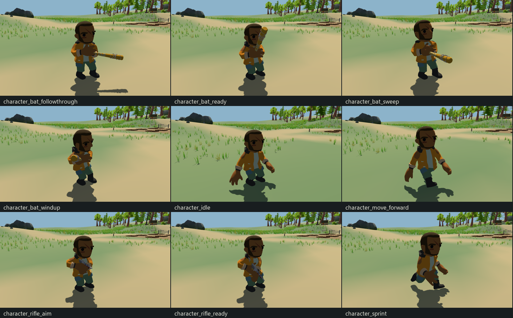
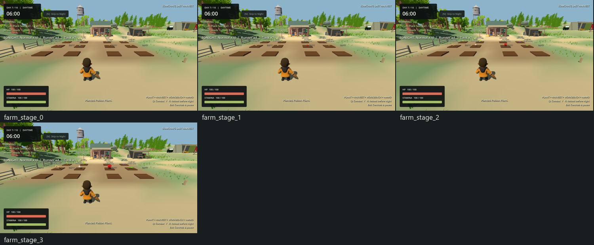

# Gameplay & Character Refinement — Somchai's Last Harvest

**Completed 2026-10-02 — STOP for user review.** Current Godot source, run with F5. Root agent only. Stages A→B/C→D→E→F completed using existing systems/assets. The historical EXE/PCK predates this pass.

Evidence: [index](docs/gameplay_refinement/README.md), [individual process results](docs/gameplay_refinement/test_results.json), [scope audit](docs/gameplay_refinement/scope_audit.json), [production diff against the actual pre-pass dirty source](docs/gameplay_refinement/production_changes.patch). The baseline covers947 files. Exactly26 existing production files change;317 other code/scene/resource/test/tool files, all571 existing asset files including244 GLBs/21 audio files, and project/export settings are hash-preserved. Eight plant resources retain all economic/stage fields; only their visual source and optional produce-marker setting change. Inventory/Equipment/FarmPlot/crafting/AI/waves/clock/progression/map architecture is preserved. No commit, push or new export.

## 1. Stamina before/after values

| Setting | Before | After |
|---|---:|---:|
| Maximum | 100 | 100 |
| Sprint drain /s | 22 | 14 (−36.4%) |
| Recovery /s | 18 | 28 (+55.6%) |
| Recovery delay s | 1.20 | 0.65 |
| Exhausted restart fraction | 25% | 25% |
| Walk /sprint /aim speed m/s | 4 /7 /2.8 | 4 /7 /2.8 |

Only exported defaults in `StaminaComponent` change; existing exhaustion, clamp, recovery and HUD logic remain. Sprint still has a finite cost; maximum and movement physics were not increased to improve animation.

## 2. Sprint duration before/after

Identical actual input fixture, full stamina, 60 Hz physics: **4.5667→7.1667 simulated seconds** from full to exhausted. This is approximately57% longer. Measurements include one-tick input/state transitions, so they differ slightly from100/drain. Both runs assert empty exits sprint and every sampled stamina/HUD value stays in range. [Before](docs/gameplay_refinement/gameplay_stamina_before.json), [after](docs/gameplay_refinement/gameplay_stamina_after.json).

Partial recovery/restart,20s held sprint, real grounded uphill/downhill and a live Runner chase pass. Sprint7m/s still needs stamina to outrun Runner4.5m/s; ordinary walk4m/s cannot maintain that advantage indefinitely.

## 3. Recovery behavior

| Actual release measurement | Before s | After s |
|---|---:|---:|
| First positive recovery | 1.2167 | 0.6667 |
| Empty→full, including delay | 6.7667 | 4.2333 |

Exhaustion requires25 stamina before sprint restarts. HUD matches each sampled tick within its existing0.01 bar precision; no redesign. The first baseline harness used a stricter-than-bar precision and was repaired; its failed log is retained alongside the passing identical measurement.

Live night:3s/180 ticks of Runner escape leaves58 stamina; a0.75s pause in sprint already begins recovery while the enemy remains active. No negative/overflow/infinite-sprint behavior was found. Bed/rest and natural-dawn recovery rules remain unchanged.

## 4. Character animation changes

Actual Matt model:43 bones,20 imported clips, same skeleton throughout. No native rig, rest pose or animation library is edited. Instance libraries retain existing knife hiding; new presentation reuses existing motion.

| Requested motion | Actual asset status | Current use |
|---|---|---|
| Idle | FOUND /USABLE: Idle | Farming and melee ready |
| Walk | FOUND /USABLE: Walk | Velocity-correlated cadence |
| Run | FOUND /USABLE: Run | Actual sprint movement |
| Sprint | NOT FOUND as separate clip | Existing Run/Run_Gun |
| Rifle Idle | FOUND /USABLE: Idle_Gun | Ready/aim base with local arm pose |
| Rifle Aim | NOT FOUND | Existing gun clip plus bounded torso/arm modifier |
| Rifle Walk | FOUND /USABLE: Walk_Gun | Ready/aim movement |
| Rifle Run | FOUND /USABLE: Run_Gun | Gun sprint |
| Strafe | NOT FOUND | Existing lower-body direction adjustment |
| Backward | NOT FOUND | Signed playback while aiming |
| Shoot | NOT FOUND | Immediate gameplay shot plus visual recoil |
| Reload | NOT FOUND | Existing timer-driven hand/weapon dip |
| Melee Swing | FOUND /USABLE: Slash | Adapted for0.48s bat swing |
| Bat Swing | NOT FOUND as dedicated clip | Slash plus local bat/socket sweep |
| Hit | FOUND /USABLE: HitReact | Existing native asset retained |
| Death | FOUND /USABLE: Death | Existing native asset retained |

All used clips belong to Matt; none needs retargeting. Other supplied actors were inspected, but no cross-rig retargeting was introduced. Full native list with lengths: Death0.75, Duck1.6667, HitReact0.5833, Idle1, Idle_Gun1, Jump0.3333, Jump_Idle0.5, Jump_Land0.3333, No1.6667, Punch0.75, Run/Run_Gun/Run_Slash/Run_Stab0.7083 each, Slash/Stab0.8333 each, Walk/Walk_Gun1 each, Wave/Yes1.6667 each. [Actual rig log](docs/gameplay_refinement/logs/baseline_rig.log).

Movement blends change0.10→0.12s, idle0.16→0.14s; playback rate approaches its speed target at12/s while retaining phase. Native walk stroke is about1.31m/s. Walk rate caps at2.2 for the unchanged4m/s physics speed; aim walk is about2.14. Run uses calibrated6m/s cycle speed, so sprint rate is about1.17. A faster2.16 Run rate was rejected after it increased foot drift.

Matched current-code cadence sweep at confirmed full4/7m/s: near-floor left-foot drift proxy falls Walk2.826→2.090m/s (26%) and Run4.043→3.394m/s (16%) versus the original1.0 playback rate.120 samples after45 warm-up ticks,7cm near-floor band; this is an animation comparison, not perfect foot locking. Residual sliding remains. [Candidates](docs/gameplay_refinement/gameplay_stride_candidates.json), [selected](docs/gameplay_refinement/gameplay_stride_selected.json). Native Slash plays at about1.74× during0.48s melee, blends in0.06s and returns to normal movement.

## 5. Weapon holding changes

Basic Rifle is the **only usable firearm**. Shotgun and other guns exist as source assets but have no current gameplay WeaponData/loadout. All weapon candidates were inspected; no unrequested shotgun system was added.

Reuse the unit-scale `Visual/WeaponSocket` and existing `RiflePose` SkeletonModifier3D. Rifle native scale0.5, orientation, primary/support/muzzle geometry remain. Add `SecondaryGrip` as the existing support marker's compatible alias. Per-weapon ready/aim offsets are stored in WeaponData and weapon scenes: rifle ready(−0.18,−0.06,0.24), aim(−0.18,0.04,0.21), ready pitch32°. Hold reference is the torso, producing a lower ready pose with tucked elbow poles and smooth aim transition.

Matt has no Hand bones: Middle1.R/L knuckle/palm anchors are used. The modifier retains unit-scale socket handling rather than inheriting the imported skeleton's110 scale. Final rendered pose anchors pass the0.04m threshold; stationary diagnostic errors are below0.000047m, with earlier moving rifle maxima0.01365m. These measure marker placement, not perfect palm/finger skinning. Melee reuses21 native Idle_Gun finger rotation tracks; coarse fingers and occasional clipping remain.

Bat scene uses actual `Wooden Bat Barbed.glb`, scale0.8, about0.99m long, two grip markers and a HitTip. It is visibly the supplied barbed model. Visual attack facing is held during the swing; physics capsule/movement stay authoritative. No general IK framework or scattered per-weapon transform service was created.

## 6. Aim changes

Rifle aim retains camera yaw, camera target/hitscan authority and the same crosshair. The existing modifier adjusts torso/arms within bounds and converges the weapon's +Z muzzle toward the target, with a near-target fallback. CharacterBody root stays upright; camera pitch limits remain.

Final regression passes pitch−60/−30/0/30/+44°, muzzle alignment dot>0.99968, two grips, A/D strafe, backward motion, close target bounds, immediate shot/recoil decay and1.5s reload ammo transfer. Shot damage is not delayed for presentation. Recoil/reload overlays follow actual runtime timers. Bat LMB requires Combat, not RMB; RMB may use the existing focus behavior, with no new lock-on.

## 7. Wooden Bat implementation

WeaponData appends `MELEE = 4`, preserving prior enum IDs and all firearm data behavior. Melee validates its own interval/range/contact values without ammo/magazine/reload. Existing WeaponRuntime stores per-weapon cooldown, swing time, one-contact flag and cached facing; WeaponController branches to `try_swing` through existing LMB input.

At contact, one short sphere physics query (radius0.65m) selects the nearest living generic Health target within1.6m of the player root, vertical difference≤0.85m and forward half-angle55°. A short cover ray rejects blocked contact; it does not provide ranged bat damage. Each swing can damage only one target once. Holding LMB does not auto-repeat. Cooldown persists across switching and pauses; mode/menu/switch/ownership removal/death cancel pending contact.

From Day1 GameRoot grants an owned bat through existing inventory/equipment, slot2; rifle stays selected in slot1. Wheel, bag loadout and ownership use the same systems. No stamina cost, ammo, magazine or reload. HUD reports bat damage/no ammo and LMB. Existing six-voice GameAudio pool plays swing/hit cues; existing enemy Health feedback/hit confirmation remain.

New production assets/data: `scenes/weapons/WoodenBat.tscn`, `resources/weapons/wooden_bat.tres`, `resources/items/wooden_bat.tres`, `assets/ui/items/wooden_bat.svg`, `assets/audio/bat_swing.wav`, `assets/audio/bat_hit.wav`. Extensions: WeaponData/Runtime/Controller, PlayerVisual/RiflePose, GameRoot/Player scenes, catalog, HUD/audio and guide. Inventory/Equipment code is unchanged.

## 8. Bat balance

| Property | Current |
|---|---:|
| Damage | 10, requested starting balance |
| Attack interval | 0.85s |
| Contact delay /swing duration | 0.18s /0.48s |
| Root-to-target range | 1.6m |
| Ammo /reload /stamina cost | None |
| Ideal damage per second | 11.76, versus rifle100 before reloads |

| Enemy | HP | Verified isolated bat swings to kill | Rifle hits | Ideal earliest bat kill s |
|---|---:|---:|---:|---:|
| Normal | 100 | 10 | 5 | 7.83 |
| Runner | 60 | 6 | 3 | 4.43 |
| Tank | 300 | 30 | 15 | 24.83 |

Ideal times are arithmetic0.18+(hits−1)×0.85, excluding approach, misses and interruptions; they are not measured live kill times. Variant count tests freeze enemy AI for repeatable hits. Separate live night keeps pursuit/player damage: exhaust3 rifle rounds on Normal (remaining40HP), wheel/approach/bat4 hits to kill; escape Runner by sprint then bat6 hits; damage Tank10 and escape. Headless finishes30HP; rendered capture finishes5HP because capture frames allow additional Tank attacks. No invulnerability was used. Recorded contact is near0.18s within one60Hz tick (observer logs0.1667s); wind-up has no early damage. The bat is substantially weaker and riskier than ranged fire, but zero ammo no longer prevents damage/kill.

## 9. Plant asset audit

Actual imported/rendered audit before plant edits: **all68 Stylized Nature MegaKit GLBs**, including small/big plants, both clovers, fern, flowers/petals/groups, grass, bushes, mushrooms, rocks and trees. All other supplied filenames were checked for plant candidates. Two optional RPG accents Mineral/Snowflake were inspected and not needed. No authored seedling/crop growth sets were found. The full68-row source/status/mesh/material table is in [PLANT_VISUAL_ASSET_MAPPING.md](PLANT_VISUAL_ASSET_MAPPING.md).

The broader audit is138 models:68 Nature,59 weapon-related candidates including two Battery filename false positives, nine actors and two accents. Two real wooden bat sources are Barbed and Saw; Barbed suits the fallback, while Saw is a blade. [Combined native measurements](docs/gameplay_refinement/asset_audit_combined.json), [all138 rendered source images](docs/gameplay_refinement/audit), [audit contact sheets](docs/gameplay_refinement/contact).

## 10. Plant visual mapping

All source names below are under `Asset/Stylized Nature MegaKit.undefined-glb`; eight unique GLBs retain their native colours/orientation/materials. Each static wrapper centres measured X/Z bounds, grounds minimum Y and uses a bounded uniform scale.

| Existing plant | Native source | Mature footprint /height m |
|---|---|---:|
| Lead | Plant Big.glb — purple pointed rosette | 1.100 /0.205 |
| Paper | Clover.glb — two broad leaf stems | 0.473 /0.680 |
| Iron | Plant Big-MbhbP7JrTI.glb — tall blade tuft | 0.716 /0.860 |
| Copper | Flower Single-GvfHo0roi3.glb — hanging yellow pods | 0.355 /0.800 |
| Small Herb | Fern.glb — radial green fronds | 1.100 /0.327 |
| Fire Pepper | Bush.glb — rounded red foliage | 0.919 /0.740 |
| Ice Plant | Mushroom.glb — pale umbrella cluster | 0.950 /0.565 |
| Poison Plant | Mushroom Laetiporus.glb — tiered shelf fungus | 0.920 /0.517 |

Each PlantData selects its own `scenes/farming/visuals/*PlantVisual.tscn`; FarmPlot has no per-plant branch. Starter and magical crops use different silhouettes rather than one recoloured model. **Water/Electric are NOT FOUND in the actual gameplay catalog**; no fictitious seed/economy/unlock was added. Fire/Ice/Poison models are thematic analogues, not literal authored crops.

## 11. Growth-stage visual strategy

Existing seed marker and data thresholds0/0.25/0.65/1 remain. Seed marker is the existing small soil marker; sprout/growing/ready reuse that plant's native model at0.35/0.70/1.0. Scaling also scales the wrapper's ground correction, so no floating/duplicate imported model. Existing Ready interaction/plot label and maturity size cue remain. The generic floating produce prism is disabled in these eight data resources through optional `show_produce_marker = false`; defaulttrue preserves custom data behavior.

No authored growth sets exist, so scaled stages are explicitly an approximation. Existing `stage_visuals[]` supports future data-only stage replacements and its regression passes. All24 non-seed stage geometries pass minimum-Y error<0.001m, footprint≤1.102m, height≤0.861m, one native model and no plant collisions. Actual selection/E planting consumes one seed; real clock readiness/E harvest delivers the unchanged quantities and clears the plot. Full inventory retains ready crop atomically. [Geometry](docs/gameplay_refinement/gameplay_plant_geometry.json).

## 12. Tests performed

25 recorded relevant individual process gates pass, including clearly labelled baseline/audit/comparison entries; this is not25 distinct current gameplay suites. [Full result manifest](docs/gameplay_refinement/test_results.json) checks expected result lines and engine/parser/assertion/navigation diagnostics. Only the exact pre-existing `ERROR: Failed to read the root certificate store.` is excluded. Process exits were observed0 in tool results. All intermediate logs remain, including repaired fixture errors.

| Current check | Result /coverage |
|---|---|
| Stamina /movement | PASS: actual full→empty/recovery/HUD, partial restart, finite20s hold, grounded hills |
| Cadence /rig /hand audit | PASS: native clips/bones/21 finger tracks, full-speed4/7m/s sweep and selected cadence |
| Final aim | PASS: vertical, strafe/backward, upright body, near/far muzzle, immediate shot/recoil, real reload |
| Bat logic /rendered | PASS: input/wheel/ownership,10damage, contact timing, short range/behind/cover, single target, held/cooldown/anti-swap, mode/menu/death/removal cancellation, variant10/6/30, zero ammo, rifle magazine/reserve persistence |
| Plants logic /rendered | PASS: all8 seed selections/E plant/harvest,24 geometries, clock growth, capacity rollback, future data-only stage art;13 player-camera images inspected |
| Live night logic /rendered | PASS:3 real rifle shots→zero ammo→bat Normal/Runner kills, Runner sprint/recovery, live Tank damage/escape; damaging AI retained |
| Ordinary full-day regression | PASS: unchanged cleanup_full_day.gd; finite starter seeds/natural clock/eight planted/harvested crops,40 crafted ammo+medicine,six real damaged-combat rifle kills, earned E-bed to healthyDay2; independent damaged natural dawn without rest/healing |
| Final rendered character | PASS: Idle/Walk/Run, rifle ready/aim, bat ready/windup/sweep/follow-through/recovery, grips/unit scale/unarmed visibility |
| Plant performance | PASS: source before/after and sequential current-code legacy/current art replay |
| Final editor import /normal rendered boot | PASS: current source opens without functional parser/runtime/navigation error |
| Scope /runner syntax | PASS: protected hashes/economic fields; portable PowerShell syntax clean |

Focused tests use temporary grants/clock setup or frozen variants to isolate edges; all-eight plant setup opens Day7 availability only in the fixture. Live night controls Day2/time/enemy factory and disables ordinary waves, retaining pursuit/damage. Ordinary full-day separately uses natural time/resources/no direct enemy damage. Fixed60Hz headless simulation is accelerated wall time; character/farm/night screenshots use real rendering. No human keyboard/listening test or fresh ten-day campaign is claimed.

Earlier harness repairs: HUD rounding tolerance; stride audit type/path; clear-lane full-speed fixture; profile clone PlantData type annotation. The naive faster Run cadence was rejected by measured drift. Retained logs document these rather than hide them. Portable `tests/run_gameplay_refinement.ps1` is prepared/syntax checked; corresponding individual gates were run, the wrapper was not rerun as a separate combined suite.

## 13. Known issues

- Residual foot sliding and occasional palm/body/weapon clipping remain. Knuckle marker errors are not a perfect-skinning metric; fingers are coarse and the rig has no Hand bones.
- Aim/shoot/reload/strafe/backward/dedicated bat clips are absent; local pose approximations reuse native motions. Walk rate2.2 is bounded to avoid forcing extremely fast cadence on the short imported stride.
- Growth stages scale mature art. Fire/Ice/Poison are themed vegetation analogues; Water/Electric are absent gameplay.
- Damage10 is starting balance. Live Tank contact is dangerous (rendered test finishes5HP). Human difficulty/enjoyment/listening and a new full campaign are unmeasured.
- Existing static rescue rotor, unsaved campaigns, craft-only medicine/elemental ammo and decorative supplies remain as documented in [KNOWN_ISSUES.md](KNOWN_ISSUES.md).
- Historical EXE/PCK is older. Source F5 contains this pass. Latest gates have no unresolved functional parser/runtime/assertion/navigation error; the known local certificate-store diagnostic remains.

## 14. Placeholder assets

The bat and all eight mature plant models are real existing source assets, unchanged; no primitive bat or one-model crop recolouring was used. The selected bat includes native barbed wire.

Explicit approximations/placeholders: two deterministic procedural bat cues (swing0.28s/hit0.16s) through the existing audio pool; simple SVG item icon; existing seed marker; scaled mature growth stages; local weapon/arm/torso/recoil/reload/strafe/bat pose adaptations over Matt clips. Audio playback wiring is verified with Dummy audio; quality/listening is not certified. No dedicated bat sounds/growth sets/action clips were found in supplied assets.

## 15. Performance impact

Godot4.7.stable.official.5b4e0cb0f /Compatibility, NVIDIA RTX4060 Laptop /driver610.74,1920×1080,12 grown plants,600 rendered frames per scenario, real-time sampling without fixed-FPS. Night is synthetic12-alive stress, not a sustained campaign. A separate pre-existing Godot process remained during both source measurements; no OS-wide isolation or low-end/release certification.

| True source before→after | Mean ms | p99 ms | Draw calls | Nodes | Static memory B |
|---|---:|---:|---:|---:|---:|
| Day before | 15.010 | 18.183 | 2372 | 1229 | 89,755,053 |
| Day after | 5.243 | 9.727 | 2332 | 1230 | 90,076,991 |
| Night12 before | 16.151 | 20.697 | 2496 | 1793 | 97,682,461 |
| Night12 after | 5.790 | 9.749 | 2428 | 1794 | 97,993,863 |

The large timing difference is not attributable to plant art alone. To separate machine/sample variation, the **same current game code** was profiled sequentially with cloned old shared Plant visuals/produce marker, then current eight visuals. This art-only replay is not the pre-implementation binary.

| Same-code art replay | Mean ms | p99 ms | Draw calls | Nodes | Static memory B |
|---|---:|---:|---:|---:|---:|
| Day legacy art | 5.331 | 9.750 | 2372 | 1230 | 90,110,971 |
| Day current art | 5.322 | 9.417 | 2332 | 1230 | 90,080,231 |
| Night12 legacy art | 5.767 | 10.964 | 2468 | 1794 | 98,027,843 |
| Night12 current art | 5.942 | 10.628 | 2428 | 1794 | 97,997,103 |

Current plant art changes day mean−0.009ms and night mean+0.175ms (~3.0%), with lower p99 in both short samples. Draw calls fall40, nodes remain equal and measured static memory falls30,740B in each replay scenario. The true-source night draw difference also reflects enemy instance variation and is not all caused by plants. No substantial plant-art regression was observed in these samples.

Each selected wrapper has one native mesh part, one material except Copper's two; no AnimationPlayer, per-plant processing service or new collision. Materials are reused from source. Existing invisible seed/produce helpers remain in PlantVisual; no duplicated costly scene is added. The raw audit's legacy `triangle_upper_bound` field is a vertex-count/3 proxy, not an indexed triangle budget; it is not used to claim performance. [All four raw profile JSONs and logs](docs/gameplay_refinement/README.md). No speculative optimization was applied.

**Next exact task: STOP and await user review of this completed pass.**
