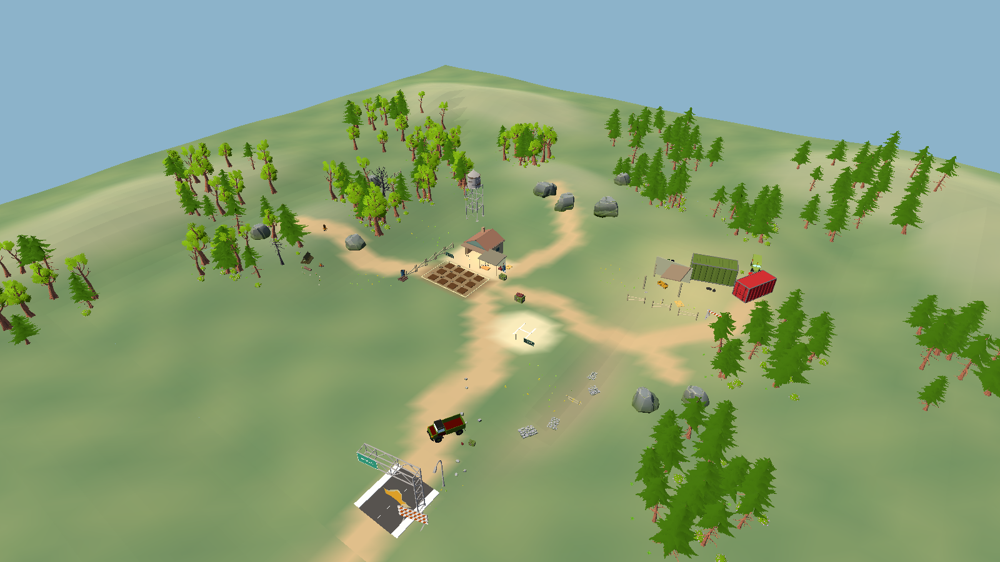
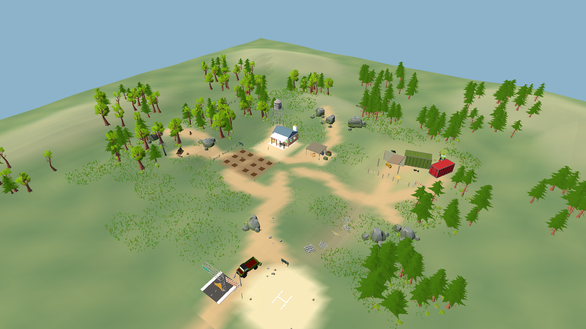
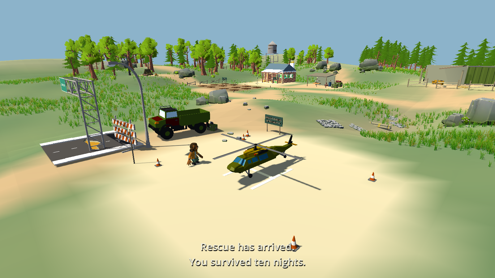
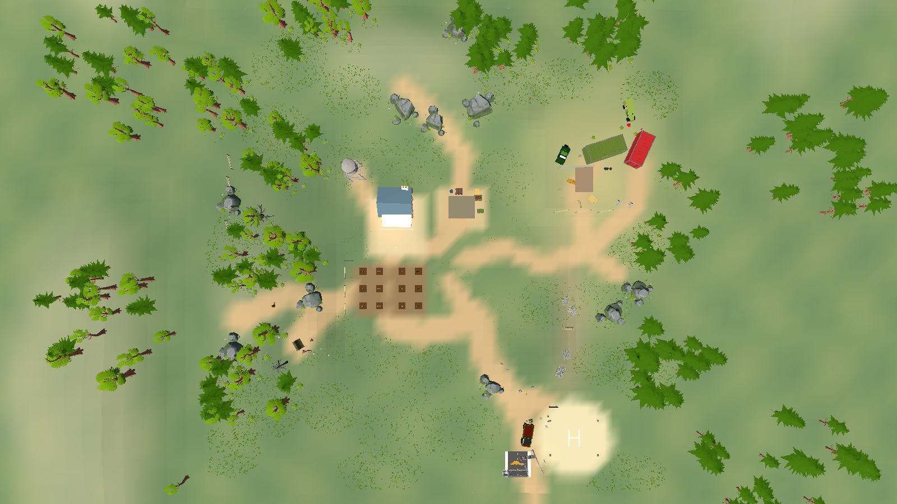
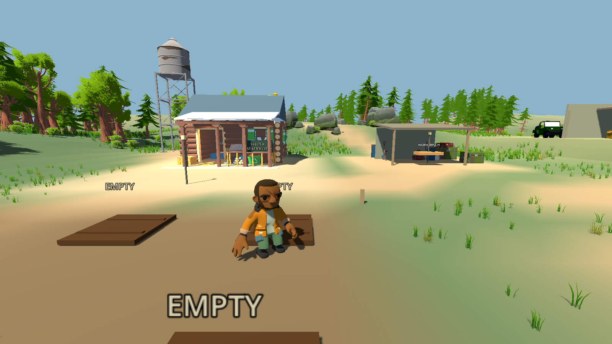
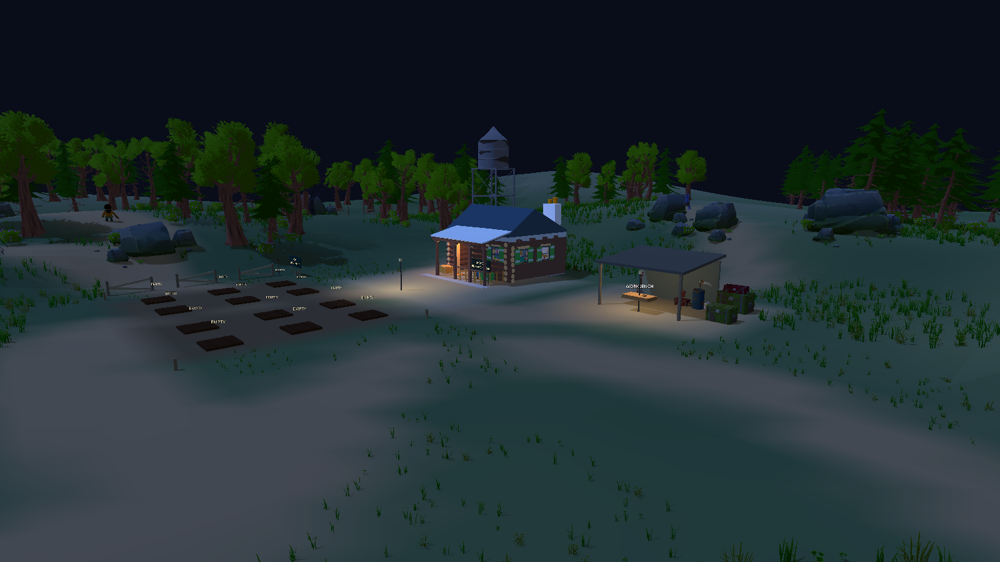

# Map Beautification & Spatial Recomposition — Somchai's Last Harvest

2026-10-01. **COMPLETE — STOP FOR MAP REVIEW.** Current Godot 4.7 source, Compatibility renderer. Root agent only. The requested order was followed: documentation and rendered baseline → rescue/road/clearing → farmstead and large composition → props/rocks → vegetation/paths → navigation/camera/night/performance → report.

**Review:** [evidence index](docs/map_beautification/README.md), [latest checks](docs/map_beautification/test_results.json), [asset mapping](MAP_ASSET_USAGE.md), [scope verification](docs/map_beautification/scope_integrity.json).

## 1. Rescue Area before / after

| Element | Before this pass | Delivered |
|---|---|---|
| Rescue interaction anchor | (13,0.05,10), near the farm | (29,0.70,43), southeast evacuation clearing |
| Ground | Small clearing in the original core | Level 0.65 m plateau, 9.5 m flat radius, gradual outer blend |
| Context | Road props separated from the landing | Supply truck, broken checkpoint, gantry sign, lamp, cones and radio/aid cache |
| Existing ending | Hardcoded positions near old rescue | Camera/player/helicopter positions derive from RescueArea |

Only ending spatial transforms changed. Sequence duration, state transitions, sound, captions and buttons match the pre-pass implementation. The existing sequence completes with the helicopter at (29,0.85,43) and actor at (25,0.68,45). Ground/rotor-volume and day/night rendered checks pass.

## 2. Rescue distance and reasoning

House centre to landing is about **67.0 m**, versus roughly 27.5 m between the former shelter and old rescue. The measured road walk starts at the front yard (-13.5,-3): **18.38 simulated seconds** at the unchanged 4 m/s player speed, over **68.1 m** of waypoint segments. This timing is actual production movement input; baseline walking time was not measured.

The south road crosses an open field and low shoulder before branching into the clearing. A roadside outcrop and vegetation screen the southern entry. All five sampled landing points are hidden from each of four representative house/farm eyes; this is sampled occlusion, not a guarantee from every possible camera. The sign/road suggest direction before the landing opens into view.

## 3. Farmstead spacing

The supplied Cabin now anchors home at (-12,-10). A broad earth apron at 0.135 m meets its floor and veranda from all sides. The first crop row is about 8.9 m beyond the porch edge. The workshop sits separately to the east, around (3,-10.1), with a clear front approach. Heavy stock and five placed firewood logs moved behind the workshop; the native cabin's compact porch rack remains part of the supplied model.

The former primitive shelter walls/roof are disabled in the scene. The farm front, yard and combat field have purposeful open space; dense growth stays along the surrounding edges.

## 4. Farm plot layout

Twelve unchanged gameplay plots form two groups of six. X columns are -7,-10.8,-16,-19.8; Z rows are 4.5,8.5,12.5. Minimum clear edge gap is **2.15 m**; the central lane is 3.55 m and row gaps 2.35 m. The low western fence is about 3.38 m away from the nearest plot edge.

Two softly irregular soil areas replace the large rigid white rectangle. Four short corner stakes mark the cultivated area. Individual plot dimensions, crop growth, yields and interaction logic are unchanged. Actual E plant/harvest passes on all twelve plots.

## 5. Props removed from the active composition

Removed the old gable/porch decoration and white rectangular farm edging. Disabled the former shelter shell/colliders and duplicate debug meshes/labels that no longer describe the world. The visible debug station box is replaced by a matching supply chest; its existing interaction remains. Door leaf/handle are hidden in the Cabin wrapper, and the thin doormat is excluded from physical collision to leave a static accessible doorway. Original asset files were preserved.

## 6. Props relocated

Workbench is (3,0,-8) within the workshop. Storage/cover body is (6.8,0.75,-12.5); root TestInteractable is (7.4,0,-9.5), alongside workshop stock. Bed is (-14.3,0.14,-12), in the Cabin's left room. Chest/radio/water/book/medical decoration occupies the right room, leaving the entry/rest lane clear.

Truck is (18,42), barrier (18,47), gantry sign (15,49), street lamp (20,47), and aid cache near (19,39). These belong to the evacuation checkpoint, outside usable rotor clearance. Existing freestanding information boards now have timber posts in contact with the ground; their text and interaction/UI behavior did not change.

## 7. Rock clusters

Ten authored groups replace isolated large rocks: three north ridge groups, a western forest group, five boundary groups and the southern roadside outcrop. Each has a dominant embedded boulder, three medium satellites, five pebbles, bush/fern/grass at its base. Dominant rocks sink 0.38 m into the height field; medium/small pieces use smaller embedding depths. Sizes and yaw vary by role. Drainage rock-path modules follow the local terrain normal.

## 8. Structure placement and ground contact

Cabin.glb was supplied before this pass and inspected as a real model: 221 meshes, 25 materials, native bounds about 1.60×1.264×1.870 m. It retains its imported materials/furniture in a wrapper normalized to 9.5 m maximum horizontal span. The source doorway was only about 1.14 m wide; static frame/log adjustments widen it to roughly 1.85 m in both render and collision. Lowering the wrapper by 0.276 m places the floor on the earth apron. No door mechanic was added.

The water tower has a blended level foundation at 0.35 m. Depot vehicles/containers/ruins occupy a common 1.85 m pad with an access path. Forest tent has its own 2.60 m clearing and gradual slope transition. Checkpoint and landing share the southern plateau. Structure coordinates and lifts are recorded in [metrics.json](docs/map_beautification/metrics.json). Rendered review covered the major structures and surrounding rock/fence contacts.

## 9. Grass density

Ground vegetation increased from **100 to 11,019 model instances**, using four existing variants and the existing **68 MultiMesh mesh batches**. There are no individual scene nodes or collisions per tuft.

| Zone role | Tufts |
|---|---|
| Combat edge | 352 |
| Forest floor | 5,662 |
| Meadow | 3,406 |
| Rock edge | 425 |
| Wilderness | 990 |
| Yard edge | 184 |

Twenty-nine authored ellipse patches plus tree/rock and yard-edge growth vary density, height, yaw and small empty pockets. Forest/meadow grass is about 0.45–0.85 m, combat edges 0.23–0.40 m, yard edges 0.16–0.28 m, with smaller clover. Plot soil, circulation lanes, veranda/interior, workshop/depot approaches, tent clearing, checkpoint and landing are excluded. Source grass colours were toned through duplicate instance materials; original GLBs remain identical.

## 10. Vegetation changes

Seventeen authored tree clusters use seven live variants and two dead-tree landmarks, with clearings and openings rather than even spacing. **116 playable trunk colliders** remain; canopies, understorey and distant background have no collision. Tree placement excludes paths and the landing perimeter. Bush/fern growth follows tree edges, rocks, terrain transitions and the reclaimed depot. The red Bush variant is limited to four depot placements; green understorey uses the appropriate inspected model.

## 11. Paths / routes

The main south road goes (0,7)→(7,16)→(9,25)→(14,33)→(18,41), continuing into the visual background. Its landing branch goes (14,33)→(21,35)→(25,39)→(29,43). Yard circulation connects the house, workshop and central farm lane. Additional branches reach the tower, forest camp and depot. Existing north ridge, west woodland and east approach paths remain integrated into the height/color field.

Road/yard/landing use sparse growth and soft dirt edges; denser patches begin outside circulation. No new collecting, storage, healing or route objective was introduced.

## 12. Zone identities and composition

| Zone | Delivered identity |
|---|---|
| Farmstead | Two cultivated groups, low broken fence, open yard and working lanes |
| House | Furnished log Cabin, veranda, domestic cache and tower landmark |
| Workshop | Independent work shelter, rear stock/firewood, tools against walls |
| Combat field | Open movement/aim space with short sparse edge growth |
| Forest | Dense irregular canopy/understorey, rock group and forester camp clearing |
| Abandoned depot | Raised common foundation, containers/vehicles/ruins and clustered debris |
| Road / evacuation | Open transition, screened bend, checkpoint and separate level landing |
| Boundary / background | Tree groups/gaps, ridges/rocks/broken pasture fence and continued road |

Top view reads the house/farm/workshop as one farmstead and the rescue clearing as a second destination. The wider world remains 112×112 m playable /240×240 m visual. Negative space is deliberate around daily work, combat and landing.

## 13. Navigation and gameplay regression results

Final bake: **3737 polygons**, cell size 0.25 m, cell height 0.05 m, detail sampling 3 cell units. Map cell height matches the bake; merge precision is 0.001. Agent radius 0.5 m, height 1.8 m, climb 0.2 m and slope 45° retain their prior values. The exact edge audit finds zero edges shared by more than two polygons, and final runtime logs have no navigation synchronization warning.

The finer Y sampling resolves path points that sat too high above the ground for the existing controller. An initial two-edge overlap on the western hill was traced to detail triangulation; closer detail sampling removes it. Godot's [NavigationMesh documentation](https://docs.godotengine.org/en/stable/classes/class_navigationmesh.html) describes matching map/bake cell heights and detail sampling. Enemy AI and movement code were preserved.

All **24 actual Normal/Runner/Tank routes** reach attack state from four real entries, once toward the open field and once inside the home. Times are simulated seconds, with unchanged enemy speeds and a 60-second fixture limit for the longer world:

| Variant / target | North | East | South | West | Result |
|---|---|---|---|---|---|
| Normal / field | 22.45 | 23.77 | 18.27 | 21.77 | 4/4 |
| Normal / bed | 20.28 | 32.85 | 30.18 | 17.30 | 4/4 |
| Runner / field | 10.00 | 10.53 | 8.12 | 9.68 | 4/4 |
| Runner / bed | 9.03 | 14.62 | 13.55 | 7.72 | 4/4 |
| Tank / field | 29.90 | 31.60 | 24.47 | 29.00 | 4/4 |
| Tank / bed | 27.00 | 43.90 | 40.43 | 23.03 | 4/4 |

Further current-map checks pass: actual walking to twelve plots/bench/bed/rescue; twelve E plant/harvest pairs; twenty-two zone/entry/edge destinations; all four physical boundaries; twelve actual night rifle cases; ordinary Day 1 spawning through all four grounded entries. Representative farm-eye rays screen all entries.

The ordinary-resource full-day fixture plants eight starter seeds, grows/harvests naturally, crafts 40 ammo and one medicine, uses 30 real shots to clear six production enemies after taking damage, walks into the home and rests through E to healthy Day 2. The separate unprepared night reaches natural dawn at 90 HP /81.67 stamina without sleeping. No gameplay grants/time seeks/healing/direct kills are used in these full-day cases. Geometry/combat/capture fixtures separately pause time, disable damage, grant resources or seek time to isolate their map checks; those are not economy/difficulty evidence.

Failures and repairs are retained in [logs](docs/map_beautification/logs): narrow entry/raised threshold, porch-side access, coarse Y path points, initial steep clearing blends, unscreened south entry, asynchronous test setup, obsolete kite route and intermediate navigation rasterization. The final checks pass. Historical suites with fixed old map coordinates were not represented as newly rerun or current validation.

## 14. Camera / visual acceptance

Both shoulders at four yaws pass 120 base and 176 world clearance samples. The rendered survey walks to home, farm, workshop, rescue and all four entries through actual player input, recording four cardinal views each. Matched top/overview/farmstead/rescue/background cameras and a night farmstead view are included: 38 before and 38 after survey images. Five rescue views include gradual reveal, farm-side occlusion, night and the existing daylight ending. Sixteen night combat/wave images supplement these.

Reviewed home/farm 360°, human scale, horizon layering, plot lanes, terrain contacts, landing approach, night targets and the top layout. The finished composition provides domestic/work/field/evacuation relationships with clear circulation and dense/open rhythm. This is automated input and rendered image inspection, not human keyboard playtesting.

## 15. Performance impact

Same unmodified four-scenario profile before/after, RTX 4060 Laptop, Godot 4.7 stable Compatibility debug, unlocked rendering, 120 physics-frame warmup and 600 rendered samples per scenario. Synthetic final-night stress keeps twelve living enemies with damage disabled; performance is not balance evidence. The final profile ran after the current-map QA jobs completed. A separate Godot process remained present; OS-wide isolation was not certified.

| Scenario | Mean ms before → after | p99 ms before → after | Draws before → after | Nodes before → after | Static MB before → after |
|---|---|---|---|---|---|
| day_720p | 2.303 → 4.640 | 4.731 → 7.546 | 731 → 2137 | 924 → 1130 | 66.08 → 88.88 |
| final_night_12_alive_720p | 3.241 → 5.873 | 5.502 → 8.331 | 792 → 2231 | 1488 → 1694 | 74.11 → 96.97 |
| final_night_12_alive_1080p | 3.265 → 5.684 | 6.008 → 9.194 | 804 → 2250 | 1488 → 1694 | 75.60 → 98.46 |
| ending_1080p | 2.338 → 4.877 | 5.309 → 9.625 | 541 → 1012 | 937 → 1143 | 71.30 → 94.18 |

The denser grass and native multi-part Cabin increase rendering cost and memory. Existing vegetation batching and scale-aware LOD were retained. All sampled scenario p99 values stay below a 16.67 ms /60 FPS frame budget on this machine, so no further vegetation-system rewrite was needed. These are brief debug samples from the measured camera positions; lower-end hardware, sustained moving-camera load and release performance are not certified. Raw [before](docs/map_beautification/performance_before.json) and [after](docs/map_beautification/performance_after.json) data include maxima and timing monitors.

## 16. Remaining visual issues / scope / stop

- Mixed source art remains stylized: some vivid leaf colours, bright Cabin veranda/roof surfaces, and simpler workshop/ruin geometry.
- Far southern/eastern horizon views retain broad open ground between tree groups. The outer ring is visual scenery; invisible safety remains at ±56 m.
- Existing crop state labels, primitive crop/plot art, character clipping/foot sliding and static rescue rotor remain outside this map pass. Scenery supplies/chests are decorative.
- Automated precise aim and one full Day 1 loop do not certify human difficulty or a new ten-day campaign. No new export was built; the historical EXE/PCK contains the earlier world. Run current source/F5 for this map.
- The known Windows certificate-store diagnostic is retained/excluded explicitly. Latest current-map checks contain no unresolved functional/parser/runtime/navigation failure.

**Scope verified:** 195 protected pre-existing gameplay/character/weapon/UI/data files match the pre-pass snapshot. All 243 original GLBs, supplied Cabin.glb and 24 user game_sounds files match their hashes. GameRoot changed only the utility station transform; GamePresentation matches exact rescue spatial substitutions; project settings changed only navigation geometry settings. Prior unrelated edits and exports were preserved; no commit/push.

Production files changed in this pass: scenes/world/MainWorld.tscn; scenes/main/GameRoot.tscn; scripts/world/{rural_terrain,rural_environment,environment_assets,world_presentation}.gd; scripts/presentation/game_presentation.gd; resources/navigation/prototype_navigation.tres; tools/bake_prototype_navigation.gd; project.godot. Focused map tests/audits/runner and requested documentation/evidence were added. [Diff evidence](docs/map_beautification/diffs) is relative to the actual dirty pre-pass snapshot, not repository HEAD.

**Definition of Done:** rescue, house/farm, prop integration, vegetation hierarchy, composition, access, camera, navigation, night and measured performance checks are complete. **STOP for the user's map review. No further character/animation/UI/gameplay work is pending in this pass.**
