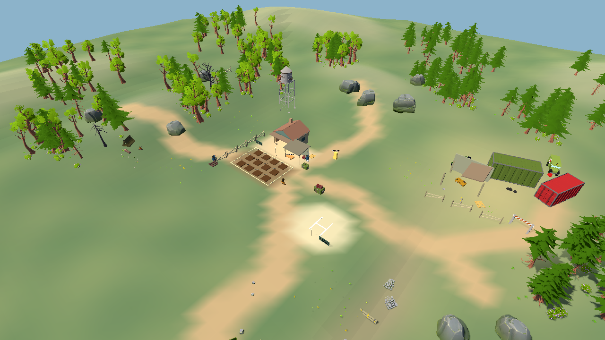
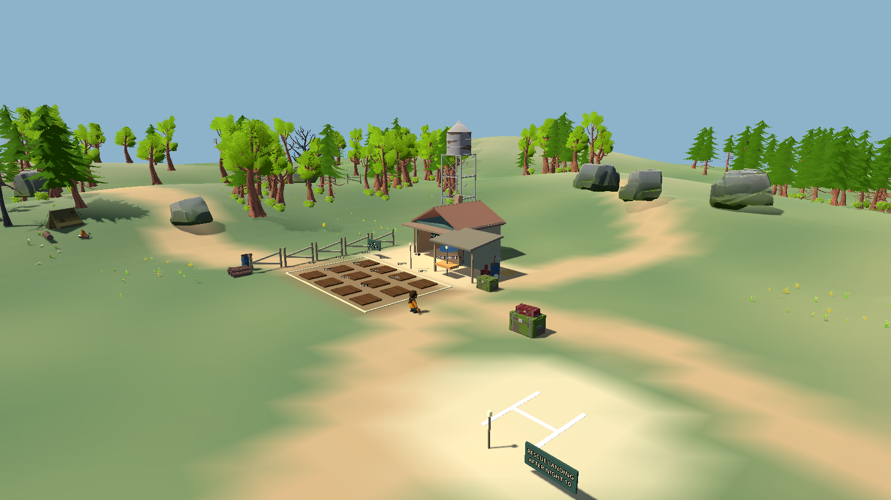
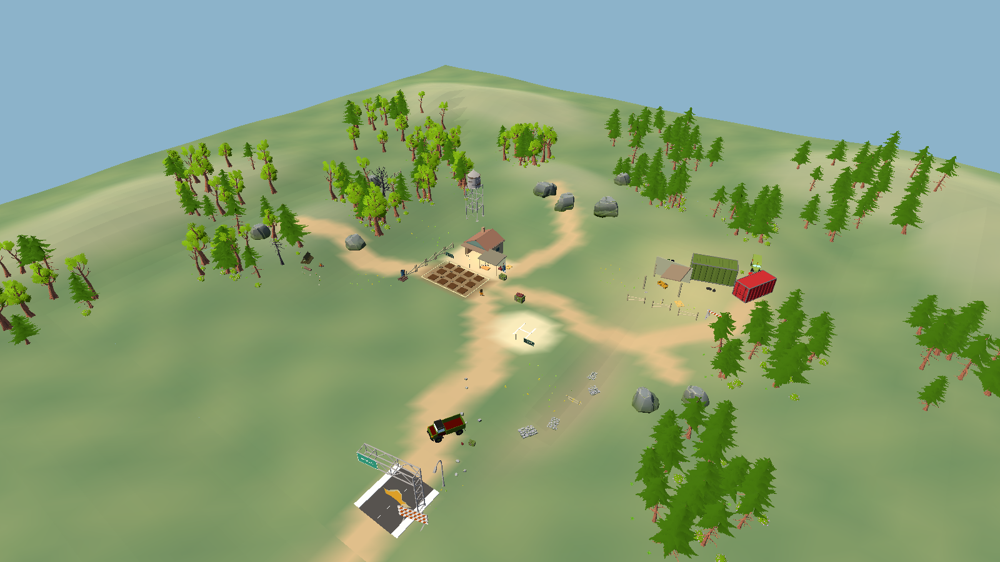
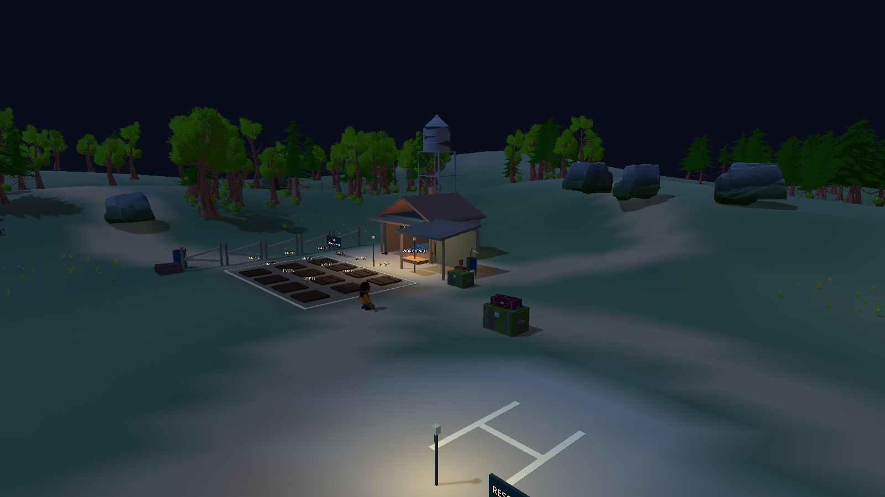

# Major Map / Terrain Redesign — Somchai's Last Harvest

2026-10-01. **IMPLEMENTATION AND AUTOMATED VALIDATION COMPLETE — STOP FOR USER MAP REVIEW.** Root agent only; previous uncommitted Refinement Pass 1 work preserved. No commit, push or new export.

เปลี่ยนลานแบนเดิมเป็นพื้นที่ชนบท 112 × 112 เมตร มีเนิน ร่องต่ำ ป่า ฐานฟาร์ม พื้นที่รกร้าง และถนนกู้ภัย พร้อมฉากหลัง 240 × 240 เมตร ตรวจการเดินด้วยตัวละครจริง ปลูก/เก็บเกี่ยว ยิงศัตรูสามชนิด ทางเข้าทั้งสี่ด้าน และภาพกลางคืนแล้ว รายละเอียดผลทดสอบและภาพอยู่ด้านล่าง งานนี้หยุดรอการตรวจ Map จากผู้ใช้

## Before / after

| Dimension | Before map pass | Current map |
|---|---|---|
| Playable footprint | 48 × 48 m; square arena walls at ±24 m | 112 × 112 m; hidden safety at ±56 m, 2.33× linear span / 5.44× area |
| Visual terrain | 145 m flat skirt | 240 × 240 m rolling background, road and tree layers beyond the playable boundary |
| Elevation | One essentially level yard | Sampled playable range -1.79 to +5.07 m; level central base, 1–2 m outer rise, 4–5 m north/west heights, low dry drainage |
| Large composition | One flat outdoor area with farm/shelter/craft/combat/rescue functions | Eight distinct authored zones with linked paths and different silhouettes |
| Landmarks | Small shelter/plot rectangle/landing labels | Five primary groups: farmhouse, water tower, western oak/dead tree, abandoned depot, southern truck/gate; north ridge is a secondary terrain landmark |
| Environment reuse | Seven GLBs used by the previous farm dressing | 69 distinct existing GLBs, 709 placements, with zone-specific purposes |
| Entry context | Cardinal marker/fence pockets around the arena | Ridge descent, abandoned depot, woodland break and winding road |
| Ground | Flat yard/soil/road rectangles | Faceted height mesh with blended irregular grass/earth/soil/yard/old-field/ditch/path regions |

Before design, all 243 original GLBs were instantiated and rendered in current Godot, including all 6 packs. Actual transformed bounds, mesh/collider counts and source triangle totals were recorded. All 13 current environment contact pages and the earlier full-pack geometry survey were inspected. There are no supplied house/barn/cliff/hill meshes; terrain and building shells are authored project geometry. Source GLBs remain unchanged by SHA-256. See [inventory](ENVIRONMENT_ASSET_INVENTORY.md) and [usage mapping](MAP_ASSET_USAGE.md).

## Terrain was built first

Terrain-only captures in `docs/map_redesign/terrain_blockout` precede the structural/prop pass. `RuralTerrain.height_at` is an authored contour field, with a flat |X|/|Z| ≤18 m centre, north ridge, west forest rise, raised eastern field and a curved dry drainage trough. The house/farm/bench/landing all retain level ground at 0 m. Higher roofs/tower provide the base skyline without moving functional anchors.

Playable mesh uses 2 m cells / 6272 triangles. The collider uses the exact same triangle vertices. A 4 m background ring adds rolling hills outside gameplay. Material color changes blend into uneven path/soil edges; no single flat plane supplies gameplay ground. Original Ground collision/render and old road boxes are disabled. Initial slope sampling found 32.59° at a ridge/centre transition; widening the transition and drainage brought the maximum sampled gradient to 28.97°, actual terrain triangle maximum 28.74°, below the 45° actor/navigation limit. No platforming or required jump.

## Eight-zone composition

| Zone | Large shape / landmark | Medium/small structure | Functional relationship |
|---|---|---|---|
| A — Farmstead | Level soil terrace, twelve plots and linked base paths | Fence edge, log/water/tool group, plot edging | Plant/harvest remains unobstructed |
| B — House / shelter | Gable/porch farmhouse and 12.5 m water tower | Domestic/medical/radio supplies | Bed remains at (-10.5, -7) |
| C — Workshop / storage | Open lean-to adjoining the shelter | Fuel, parts, pallets, crates and tools against rear/side | Bench remains at (-4.5, -1); front circulation is clear |
| D — Open combat field | Broad central/eastern meadow at 0 m | One retained crate cover and sparse transitions | Mixed open long/medium views and short views near base |
| E — Forest edge | Rolling west slope, oak/dead tree silhouettes, clearing | Tent/camp, logs, bush/fern edges | Curved woodland approach and walkable openings |
| F — Abandoned depot | Raised old field, two containers and ruined shed | Jeep/ambulance, couch, tires, pallets, utility/debris groups | Eastern entry screened behind depot |
| G — Road / rescue | Winding south dirt road, stopped truck and broken gate | Cracked threshold, sign, cone/fuel/stone groups | Existing helicopter landing at (13, 10), visual road continues |
| H — Outer wilderness | North ridge, east vegetation/rocks, west slope/fence, south road block | Background hills, clustered canopy and stone silhouettes | Hidden 112 m safety boundary; visual world continues to 240 m |

Fixed authored clusters provide dense background, medium forest edge and sparse gameplay space. Seven live tree variants, two dead variants, bushes/ferns and grouped rocks/logs reduce repetition. Only decorative rotations/scales vary with a fixed seed; plots, house and workbench retain their scale/placement. Road bank stones were reduced to two irregular groups and roadside pebbles grouped to avoid repetitive rows. Core movement/aim lanes are kept clear. Five existing lights, one sun that casts shadows, zero new lights/rigid body props/particles.

## Paths, boundaries and enemy approaches

Curved dirt paths connect shelter, farm, bench, field, western clearing, ridge, depot and southern road. Hill + trees screens north, vegetation + rocks screens east, slope + broken fence fragments defines west, and truck/gate/road interruption defines south. The visible perimeter is composed of these different features; the final invisible square is only safety collision. Background scenery/road has no playable physics. Player reached all four safety edges and was physically stopped before leaving the terrain.

Actual wave markers in X/Z: North (-10, -37), East (44, -20), South (18, 39), West (-39, 12), each grounded from the terrain height. Farm-centre eye rays to all four entries hit terrain/structural screens; this is a representative farm eye, not guaranteed occlusion from every possible elevated position. The eastern marker was moved behind the existing container depot after its initial visibility check failed. Curved paths, ridgeline boulders, depot mass and woodland gaps shape routes without a cover maze. Current spawn distances from the initial player are approximately 37.6–51.2 m.

Navigation was baked after the final geometry/trunk collision changes: **1794 polygons**, radius 0.5 m / height 1.8 m / climb 0.2 m / max slope 45°. Every playable tree has trunk collision (120 trunks); canopy/understorey and visual background are decorative. Normal, Runner and Tank retain their existing controller and tuning. All four entries reach both the open field and the interior shelter (24/24 actual enemy routes). Measured travel to attack includes both destinations and is simulated at 60 physics steps/s:

| Variant | Approach time range across eight routes | Successful routes |
|---|---|---|
| Normal | 17.80–28.70 s | 8/8 |
| Runner | 7.93–12.85 s | 8/8 |
| Tank | 23.72–38.22 s | 8/8 |

## Acceptance and regression evidence

- Real player controller/input follows paths to 22 destinations: base, forest/old field/ridge, dry drainage, rescue road, all actual entries and four safety edges. No destination-to-destination player teleport in this map acceptance walk; grounded checks pass at each destination. Both shoulders × four yaws ×22 locations =176 camera clearance samples. Additional base/plot route test adds120 samples; rendered walkthrough verifies farm/cover/wall/menu/aim interaction.
- Every one of twelve plots planted and harvested through actual E input. Separate production-clock, mouse-selected seed loop passed at **30.38 real seconds** to mature Lead, including inventory pause and exact yield. Seed wheel selection, crafting/inventory/interaction regressions pass.
- All three enemy variants fired upon and killed through actual Basic Rifle aim/fire/reload from each real entry:12/12 combat cases, at night, with line of sight gating through terrain. Each variant navigates into view; no direct kill function used in these combat cases.
- Normal Day1 night event/cadence spawned six enemies using all four actual approaches; all observed first positions were grounded. Four ordinary-wave directional images retained. Existing night sky/lighting and warm base lights were inspected with the new contours. No fog added to obscure map faults.
- Complete production Day1 seed → natural growth → harvest → craft40 ammo+medicine → rifle kill six → walk to bed → earned Day2 rest passed with finite inventory, real damage and no growth/heal/kill/day grants. Separate unprepared without rest natural-dawn case passed at70HP and81.67stamina. Menu-entered confirmed waiting version passed too. These are automated input flows, not claims of human playtesting.
- Initial broad headless regression:37/40. Stage1 expected the obsolete48 m boundary; its fixture now reads the actual outer wall. Both full day checks found a real workshop-post/field-barrel circulation problem. Moving the posts back under the lean-to and shifting the barrel outside the walking lane fixed the map; full day controllers/tests were not relaxed or rewritten. Latest results for all40 headless checks pass after targeted repairs. Final routes/map acceptance were repeated after full trunk collision and the final bake.
- Current evidence manifest: **48/48 latest checks pass** (40 headless plus eight rendered audit/acceptance/core loop/camera/capture/profile/boot checks). `tests/run_tests.ps1` now exposes40 headless /55 with the whole historical rendered suite; this pass used targeted rendered map/core checks instead of claiming a new55-check combined run. Windows root certificate-store error is the one explicitly excluded environment diagnostic; original failed logs are preserved.

Map focused route/combat fixtures grant seeds/ammo and disable player damage to isolate geometry/camera. The separate full day test retains ordinary resources/time/damage. Accelerated progression/death/ending regressions and12-alive final-night stress pass. No new full ten-day human/release campaign is claimed for this map.

## Performance

Same Godot 4.7 stable debug / Compatibility/OpenGL, RTX 4060 Laptop, same unmodified profile script, isolated process. Warmed 600 process-frame intervals per scenario, unlocked rendering, no fixed FPS. Existingcap of 12 living enemies retained. Static memory in decimal MB.

| Scenario | Mean frame ms before → after | p99 ms before → after | Draw calls before → after | Static MB before → after | Nodes before → after |
|---|---|---|---|---|---|
| day_720p | 2.268 → 6.132 | 3.993 → 8.592 | 541 → 711 | 61.01 → 66.02 | 812 → 924 |
| final_night_12_alive_720p | 3.798 → 5.214 | 5.688 → 8.101 | 654 → 797 | 69.03 → 74.11 | 1376 → 1488 |
| final_night_12_alive_1080p | 3.675 → 4.787 | 6.051 → 6.951 | 652 → 823 | 70.51 → 75.60 | 1376 → 1488 |
| ending_1080p | 1.779 → 6.398 | 2.863 → 8.341 | 535 → 541 | 66.21 → 71.30 | 825 → 937 |

All sampled means and p99 values remain below the 16.67 ms frame budget on this machine. Final observations show increased frame time in some views, more draw calls/nodes and approximately 5 MB extra static memory. Short unlocked runs varied between attempts; no speedup or sustained FPS guarantee is inferred. Current daytime scene: 924 nodes, 149 MeshInstance nodes, 68 MultiMesh nodes, 178 StaticBodies, 5 lights. Profile is brief/stationary debug stress; minimum hardware, sustained aiming/whole-map GPU timing and release-build performance remain unmeasured. No speculative renderer refactor was added.

## Before / after and views

Same-camera comparison uses the exact previous capture script at1280×720/FOV55/camera(36,45,42), plus its base/combat/night views. The separate wide overview reframes the larger world at1600×900; it is not a pixel-matched size comparison.

| Before | After, same framing |
|---|---|
|  |  |

[Complete evidence index](docs/map_redesign/README.md) includes terrain blockout created first, forest/depot/road/ridge views, twelve combat views, four normal-wave approaches, actual farming/camera captures and source/asset hashes.

## Files and preservation

- New production: `scripts/world/rural_terrain.gd`, `environment_assets.gd`, `rural_environment.gd` plus UIDs. MainWorld wires new terrain/environment, enlarged safety, grounded actual entries and hides obsolete greybox meshes. Existing navigation resource path retained and rebaked. `world_presentation.gd` changes only its map-ownership comment.
- Export preset includes the three new scripts; explicit69 GLB preloads are discoverable runtime dependencies. Previous unused `farm_dressing.gd` stays as historical source. Historical Phase10 EXE/PCK remains the previous map; use current Godot source/F5 for this map.
- Added audit/metrics/map acceptance/capture scripts. Stage1 boundary fixture, route telemetry, test runner/README updated. Three requested reports/inventory plus current project/asset/progress documentation and evidence added.
- All243 original GLBs unchanged. 173 pre-existing core/gameplay/resource files match the pre-map snapshot in every byte, including prior uncommitted player/weapon/pose/input/skip/UI work. No new animation, holding, weapon, skip, UI or gameplay system changes. See `scope_integrity.json` and `source_hashes.json`.

## Definition of done / stop

- [x] Clear raised/low/ridge/sloped terrain; usable flat core and larger playable/visual world.
- [x] Eight zones, cohesive farmstead, linked paths, forest, abandoned area, road/rescue and five major landmark groups.
- [x] Clustered large/medium/small detail, diverse actual assets, blended ground regions and layered natural boundaries/background.
- [x] Rebuilt navigation; all three enemy types /four approaches, real movement, both cameras, farming, combat and normal night cadence pass.
- [x] Available-machine performance checked; MAP_ASSET_USAGE, MAP_REDESIGN_REPORT and PROGRESS complete.
- [ ] User visual map review. **STOP here; no character refinement until the user reviews this map and requests further work.**
