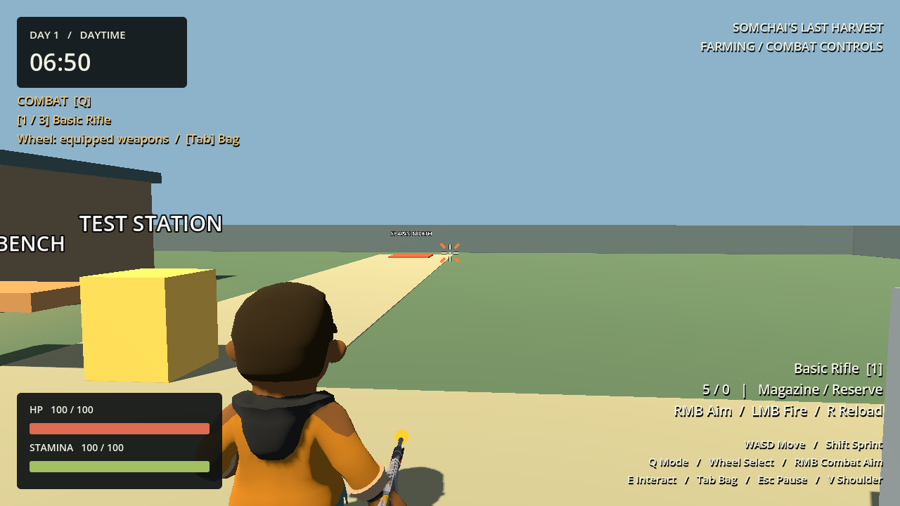

# Phase 5 — Weapon & Shooting Foundation

Verified 2026-09-29 with Godot 4.7.2, Compatibility renderer. **31 runs passed, zero failures.** Phase 5 is complete; Phase 6 has not started.

## 1–4. Weapon data, runtime and equipment

`WeaponData` is a validated Resource containing identity, weapon type, canonical weapon/ammo ItemData, damage, shots per second, magazine size, reload duration, range, automatic/semi-auto, spread/recoil, visual scene, muzzle path and icon. Definitions remain unchanged during play. `WeaponRuntime` holds magazine, cooldown and reload state separately.

`WeaponController` binds to the existing Inventory, EquipmentLoadout, GameplayMode, camera and aim ray. Three configurable equipment slots still reference owned items without consuming them. Combat wheel skips empty slots. Each owned weapon ID retains its magazine when switching or unequipping; losing ownership removes its runtime. The existing equipment contract permits one equipped copy per ID, not distinct physical instances of the same gun.

Startup grants Basic Rifle and equips slot 1. Magazine and reserve start empty. Seed starter supplies remain unchanged. Farming hides the weapon; Combat displays the selected model. Empty equipment safely disables firing.

## 5–6. Shooting and aim integration

LMB fires only while alive, in Combat, with RMB aim active and gameplay controls enabled. R reloads in Combat; R still restarts after death. WeaponController owns these actions; player movement and camera scripts were not rewritten.

The existing camera ray supplies an aim point. The shot travels from the actual muzzle toward that point, limited by WeaponData range. A body-to-muzzle safety query detects cover penetrated by the model; the muzzle ray detects cover ahead of the barrel. Both exclude the player and use collision mask 5. A camera view of a target does not bypass muzzle obstruction.

Automatic fire preserves cooldown remainder across physics updates. Semi-auto requires another press. Every accepted shot consumes one magazine round; empty, cooling down and reloading states reject firing. Simple muzzle flash, orange hit marker and dummy flash provide feedback.

## 7–8. Ammo and reload

Reserve is read directly from Inventory using the weapon's ammo ItemData ID. Lead ×1 + Paper ×1 + Copper ×1 crafts Basic Ammo ×10 at the existing Workbench. R starts a timed reload; completion consumes `min(missing magazine rounds, current reserve)` from Inventory. Ammo is not deducted at reload start. Switching weapons/modes, opening a menu, losing controls or dying cancels reload without consuming reserve. Repeated R cannot duplicate reloads.

## 9–10. Damage and target

Shots find the collider's `Health` child and call the existing HealthComponent's `take_damage`. No separate HP implementation was added. `TargetDummy.tscn` has a solid collider, 100 HP, health label, brief damage flash and removal on death. MainWorld places it at (3, 0, -8). Five rifle hits destroy it. There is no enemy AI or wave logic.

## 11–12. Weapons and temporary balance

| Value | Basic Rifle |
|---|---|
| Production weapons | 1; automatic rifle |
| Ammo | Basic Ammo |
| Damage | 20 |
| Fire rate | 5 shots/second |
| Magazine | 10 |
| Reload | 1.5 seconds |
| Range | 60 metres |
| Spread / recoil | 0 / 0 degrees; configurable |
| Initial magazine / reserve | 0 / 0 |
| Dummy HP | 100 |

A temporary semi-auto pistol definition is created only by tests to verify switching, independent magazines and one-shot-per-press behavior. It is not a second production weapon.

## 13–15. Verification and results

```powershell
.\tests\run_tests.ps1 -Godot 'C:\path\to\Godot_v4.7.2-stable_win64_console.exe' -LogDirectory '.godot\test-logs\phase5_final' -WithRendering -CaptureDirectory '.godot\test-captures\phase5_final'
```

Final result: **31/31 passed**: editor import, 22 headless test scripts, main scene boot and 7 rendered runs. `SUITE_RESULT failures=0`. Logs are local ignored artifacts under `.godot/test-logs/phase5_final/`.

- Phase 5 runs actual GameRoot and physical E/Q/R/RMB/LMB/UI events through plant → harvest → Workbench → craft → reload → aim → fire → dummy death. Its crop preparation advances the game clock; the separate rendered Phase 3 regression verifies natural growth at ×1 (30.384 real seconds).
- Validated partial/full/empty reloads, spam R and LMB, inventory accounting, switching and cancellation, magazine persistence, empty loadout, automatic and semi-auto firing, and data validation.
- Validated Farming, bag, Pause, Crafting and death guards; no stale automatic fire after menus. Debug ammo is finite (+30) and unavailable while debug is disabled.
- Validated near/far targets, range limit, ordinary walls, muzzle-only obstruction and a barrel penetrating cover. Simulated 30/120 Hz updates both produce 7 shots at a configured 7 shots/second during the tested 0.9-second interval.
- Existing movement, camera collision, aiming, modes, inventory, farming, stats, clock and crafting regressions pass. Restart restores the starter rifle with an empty magazine.
- Earlier regression failures were obsolete expectations (13 catalog items, five starting inventory entries, empty starter equipment). Tests now expect 14 items, six entries and starter rifle; the equipment fixture explicitly removes the starter before testing its own weapons.
- No remaining failed tests or script/runtime errors in the final suite. The runner retains its pre-existing exception for the Windows root-certificate-store diagnostic.

Rendered captures were visually inspected:




## 16–18. Known issues, technical debt and assets

- No functional failures reproduced in the automated suite. Human long-session playtesting, export and performance benchmarking were not performed.
- BasicRifle wraps the existing Post Apocolypse Pack `Rifle.glb`; original GLBs are untouched. Model scale 0.6 yields roughly 0.98 m length, authored forward +Z; muzzle is (0, 0.122, 0.615).
- The imported player skeleton has scale 100. A BoneAttachment3D follows `Middle1.R`; the weapon socket copies position at unit scale and aims independently. The fallback socket supports a model without that bone.
- Current idle/walk arms have no dedicated two-hand aiming, reload animation or IK. The gun follows the right hand at waist level; animation polish remains. Icons reuse existing art; dummy geometry and flash are placeholders. No gun audio.
- Runtime state is session-only and keyed by unique weapon ID. Save/load and duplicate individual gun instances are future work. Balance is temporary.

## 19–20. Future integration

Special ammo can introduce new AMMO ItemData and recipes and reference them from WeaponData. Status effects, ammo selection and projectile delivery still require their own implementation; this phase implements hitscan only. Future projectile delivery can reuse the equipment, input, cooldown, magazine and reload rules.

Future zombies can expose a `Health` child on their hit collider and subscribe to its damage/death signals. Additional hurtboxes will need a receiver lookup contract. Phase 6 — Zombie AI & Basic Enemy Combat — is the next requested milestone; no zombie behavior was started.
