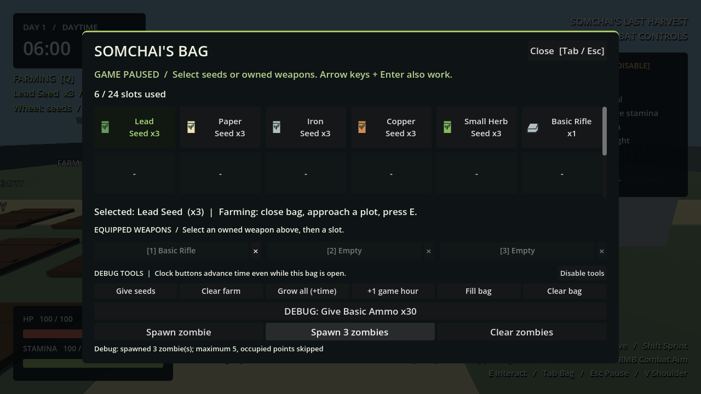
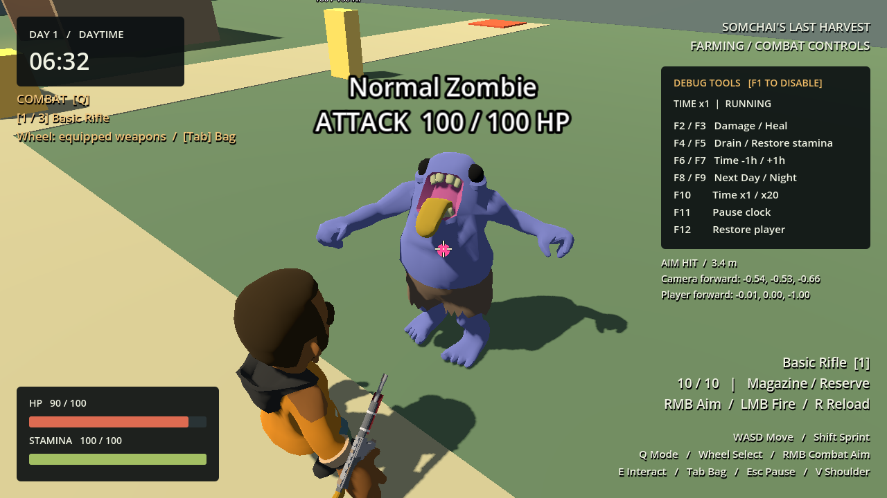
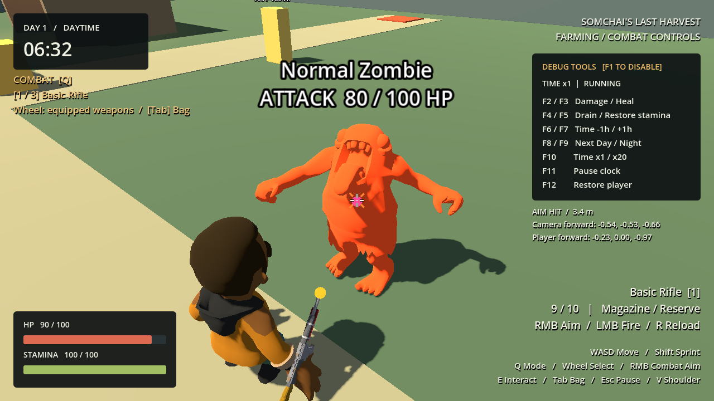
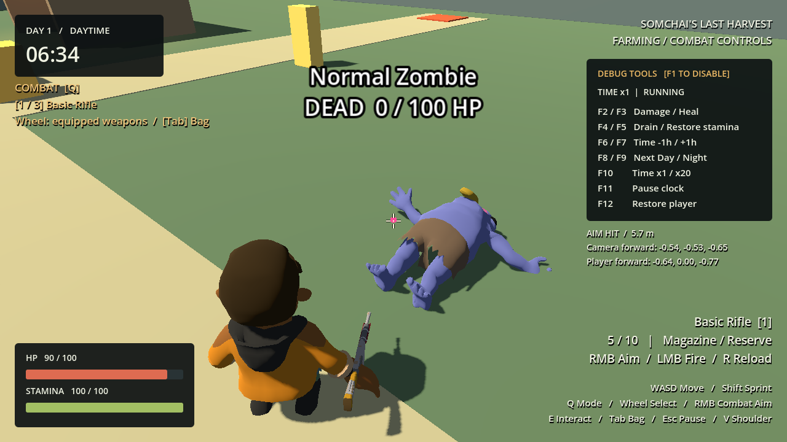
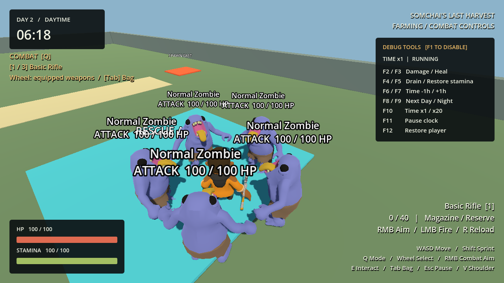

# Phase 6 — Normal Zombie AI & Basic Enemy Combat

Godot 4.7.2, Compatibility renderer. **Phase 6 complete, runtime verified on 2026-09-29: 33 suite runs passed, failures=0.** This report covers the prototype enemy; no waves or night spawning are implemented.

## Architecture, scene and data

`scenes/enemies/NormalZombie.tscn` is a reusable CharacterBody3D with CollisionShape3D, Visual, NavigationAgent3D, existing HealthComponent and optional DebugLabel. `scripts/enemies/normal_zombie.gd` owns the small IDLE / CHASE / ATTACK / DEAD state machine. AI logic remains independent of animation playback.

`scripts/data/zombie_data.gd` and `resources/enemies/normal_zombie.tres` hold identity, display name, health, speed, rotation, detection and melee ranges, damage, attack interval/windup, navigation interval, death delay, visual scene/scale and animation names. Runtime health/timers belong to each instance, not the shared Resource. Validation rejects missing identity/visual, non-finite or nonpositive tuning and windup outside the attack interval.

| Temporary setting | Normal Zombie |
|---|---|
| HP | 100 (five Basic Rifle hits) |
| Move speed / rotation response | 2 m/s / 8 per second |
| Detection range | 12 m |
| Attack range / damage | 1.35 m / 10 HP |
| Attack interval / windup | 1.2 s / 0.3 s |
| Navigation target refresh | 0.3 s |
| Death removal delay | 1.2 s |
| Capsule | radius 0.38 m, height 1.8 m |
| Model scale | 1.1 |

## Detection, chase and navigation

GameRoot injects the existing player into the test spawner; each spawned zombie receives that reference through `bind`. No relative path to Player or per-frame scene search is used. A missing/dead target returns to Idle safely; binding a restored target works. Detection is distance-based, including through walls. Outside detection range the zombie returns to Idle.

MainWorld now has a NavigationRegion3D using the committed `resources/navigation/prototype_navigation.tres` (59 polygons). It covers the current prototype ground/farm/shelter exterior and open shelter interior. The bake uses static World colliders, including walls, box, Workbench, dummy and the separate GameRoot TestInteractable. Mesh-only decoration and farm interaction Areas do not carve holes.

The bake uses radius 0.5 m, height 1.8 m, climb 0.2 m, cell size 0.25 m and cell height 0.1 m. The radius clearance exceeds the zombie capsule. NavigationAgent refreshes the destination every 0.3 s and consumes the next path position each chasing physics tick after map synchronization. CharacterBody movement handles solid collisions, gravity and floor snap. Visual rotation interpolates toward movement. Stopping distance is 75% of melee range.

Rebuild after moving static obstacles:

```powershell
& 'C:\path\to\Godot_v4.7.2-stable_win64_console.exe' --headless --path . --script res://tools/bake_prototype_navigation.gd
```

The bake script explicitly includes TestInteractable at its GameRoot location. If that prop is moved, update this location too. Navigation is pre-baked, not recalculated at startup or every frame. Removed dummy geometry leaves a small conservative detour until rebaked; moving/dynamic obstacles do not automatically replan around new geometry. Physics still blocks them.

Implementation references: Godot's [NavigationAgent guidance](https://docs.godotengine.org/en/4.4/tutorials/navigation/navigation_using_navigationagents.html) and [navigation mesh baking guidance](https://docs.godotengine.org/en/4.2/tutorials/navigation/navigation_using_navigationmeshes.html), verified against the installed 4.7.2 runtime.

## Attack and shared damage integration

In melee range, the zombie stops horizontal motion, faces the player and starts Punch. Damage is delayed by 0.3 s. The hit rechecks a living target, range and an unobstructed World ray. Escaping windup misses; a thin wall blocks melee. Cooldown starts with the swing, remains across state transitions and belongs to each zombie. It never applies damage every physics frame.

Damage calls the player's existing `HealthComponent.take_damage`, so HP, HUD, loss of controls and game-over/restart behavior remain shared. Zombie death cancels pending hits. Player death stops enemy chase/attacks on the following physics update.

The weapon uses its existing collider-child `Health` lookup unchanged. Zombie and Target Dummy use the same contract. The scene configuration expands camera aim and weapon ray masks to include Enemy. Shooting consumes the same magazine; live combat reload uses the existing Inventory reserve. No zombie-specific branch was added to WeaponController.

## Health, feedback, death and animation assets

`Asset/Post Apocolypse Pack.undefined-glb/Zombie.glb` was inspected directly. It has 3 skinned meshes (Face, Tongue, Zombie_Chubby), 3 skin entries, one material and 16 animation clips. Its skeleton uses scale 100; the wrapper applies 1.1 to the imported scene. Approximate rest bounds before wrapper are 2.35 m wide (arms out), 1.64 m high and 0.77 m deep. Gameplay forward is +Z; runtime direction is checked and rendered playback inspected. The original GLB was not edited.

Actual clips used:

| AI behavior | Imported clip | Source duration |
|---|---|---|
| Idle | CharacterArmature\|Idle | 1.0 s, loop |
| Chase | CharacterArmature\|Walk | 1.333 s, loop |
| Attack | CharacterArmature\|Punch | 0.75 s, one shot |
| Dead | CharacterArmature\|Death | 0.75 s, one shot |

Animation libraries are duplicated per zombie before changing loop flags. HitReact exists but is not played: a 0.15 s orange material overlay and the shared hit marker provide feedback without a permanent stun under automatic fire. Debug labels show state and HP and can be hidden with debug disabled.

At zero HP, DEAD is entered once, velocity and melee are stopped, collision layers/masks are cleared and the capsule is disabled. Death plays and the corpse remains for 1.2 s before removal. Spawner references are removed on tree exit. No loot or headshot logic is present.

## Collision mapping

| Layer bit | Purpose | Relevant masks |
|---|---|---|
| 1 | World | Melee obstruction and navigation bake use 1 |
| 2 | Player | Player body mask becomes 9 (World + Enemy) |
| 4 | Interactable (existing) | Farm Areas and interaction objects retain their settings |
| 8 | Enemy (new) | Zombie body mask 11 (World + Player + Enemy) |

Aim and weapon rays use 13 (World + Interactable + Enemy) and continue excluding the player. Enemy uses one capsule for movement and hits; no separate head/limb hurtboxes. Navigation avoidance is disabled; solid body collision prevents overlap, with possible crowd congestion reserved as future work.

## Debug/test spawning

No enemy automatically spawns on F5 or nightfall. In the debug section of Tab inventory, use **Spawn zombie**, **Spawn 3 zombies** or **Clear zombies**. Existing debug gates apply. Five marker locations lie on navigation ground away from the initial player. The factory projects onto navigation and rejects points farther than 1 m from the mesh or occupied by World/Player/Enemy. The test tool caps total instances at five, including pending corpses. No wave manager or time dependency was created.

## Tests and results

`tests/phase_6_zombie_test.gd` extends the existing runtime/input helpers and instantiates the actual GameRoot. Coverage includes:

- Disabled debug, no automatic spawning, 3/5 safe marker spawns, cap, occupancy rejection and hiding debug labels.
- Idle, detection, speed, facing, imported clip availability, throttled path updates and entering melee without immediate damage.
- Windup hit, cooldown, fleeing/missing, returning to Chase and blocking melee through a thin wall.
- Both approaches around the solid box, grounded movement, following actual player sprint input beside the obstacle, and navigating around the shelter back/sides to its front entrance.
- Live reserve reload, close-range hitscan with shoulder offset, hit feedback, five-shot kill, death animation, no post-death motion/attacks and delayed cleanup.
- Crossing farm plots at night, pausing AI/timers in inventory and day/night compatibility.
- Three and five simultaneous zombies: each attacks using its own cooldown, followed by killing all with the actual rifle and reload loop. The test heals the player during this prolonged multi-enemy segment to observe all agents; this is not a survival-balance claim or default invulnerability.
- Actual player death from melee, disabled controls, safe invalid target, explicit rebind, single death emission, pending-hit cancellation and invalid tuning rejection.

Full suite: **33/33 passed** (editor import + 23 headless scripts + main boot + 8 rendered runs), `SUITE_RESULT failures=0`. Logs: `.godot/test-logs/phase6_final/`. Existing movement/camera/aim/sprint/stamina/inventory/farming/growth/harvest/crafting/weapon switching/ammo/reload/clock/HUD regressions all passed. Natural Lead growth in the separate rendered Phase 3 run took 30.409 real seconds. After adding debug-button and moving-player assertions, the focused Phase 6 headless and rendered tests were rerun; both passed. Phase 6 rendering uses fixed simulation deltas and is not a real-time FPS benchmark.

Baseline Phase 5 weapon runtime test passed before implementation. Initial test-harness issues were physics synchronization after teleports and the five-enemy fixture allowing the player to die before its heal threshold; these were corrected in the test setup, without changing production damage. Final logs contain no test failures or script/runtime errors; the runner retains its existing Windows certificate-store diagnostic exception.

```powershell
.\tests\run_tests.ps1 -Godot 'C:\path\to\Godot_v4.7.2-stable_win64_console.exe' -LogDirectory '.godot\test-logs\phase6_final' -WithRendering -CaptureDirectory '.godot\test-captures\phase6_final'
```

Inspected rendered evidence:











## Known bugs, debt, performance and future phases

No functional defect was reproduced in the final suite. This is automated runtime verification, not a human long-session playtest, export or performance benchmark. Three/five-agent runs exercise path refresh and damage simultaneously. Resource creation and scene searches occur at setup, not each AI tick; a small physics-ray query is created for melee validation when in range. Navigation target refresh is throttled, while physics and hit feedback run each tick.

Melee windup is a configured timer rather than an authored animation event. Capsule damage, distance detection, static navigation, debug labels and simple hit flash are prototype choices. Five nearby debug labels overlap visually; disable debug to hide them. No audio, root motion, headshots, crowd avoidance, loot, save or specialized hurt state. Existing player aim/reload animation limitations remain from Phase 5.

Runner/Tank can reuse controller/data structure with different tuning and visual/clip references, but no variants were created. Larger bodies will need matching collider/nav clearance. A future wave system can call the spawn factory, inject the player and subscribe to `died`; wave counts should use death, not delayed tree exit. It will need its own spawn policy and population limit. **Next: Phase 7 — Night Wave & Survival Loop, only on a new prompt.**
