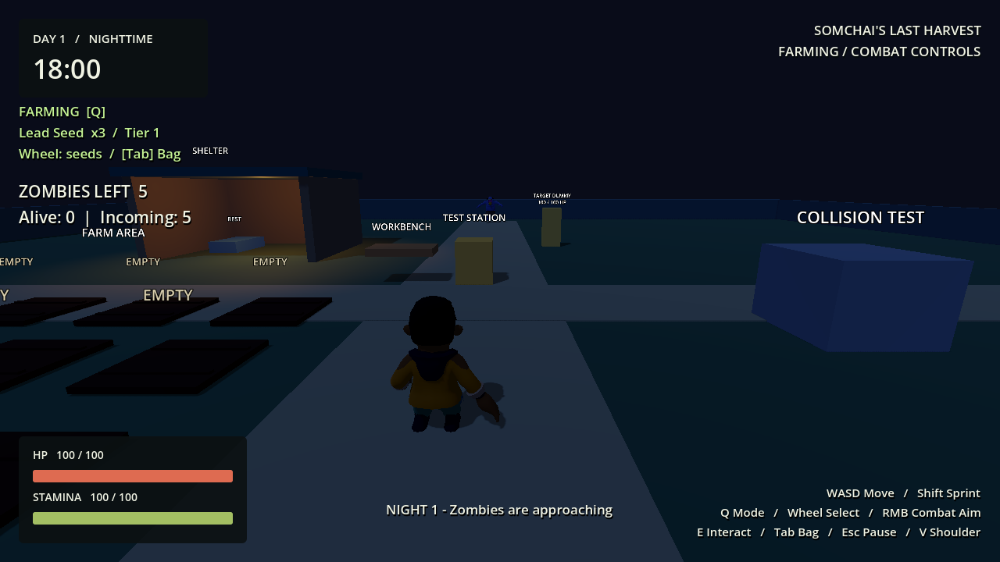
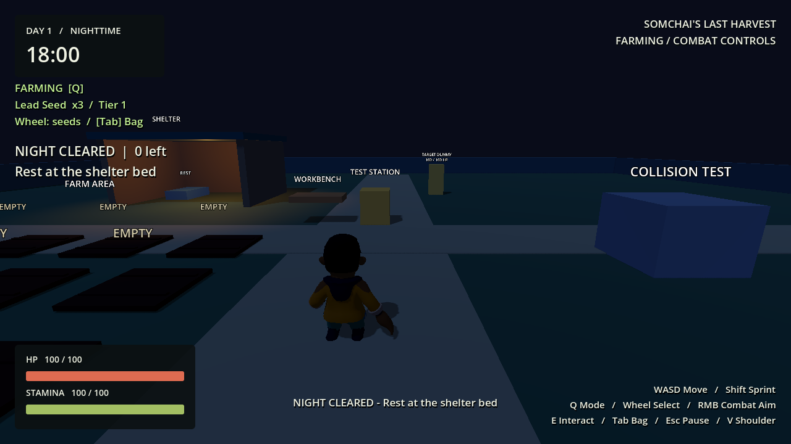
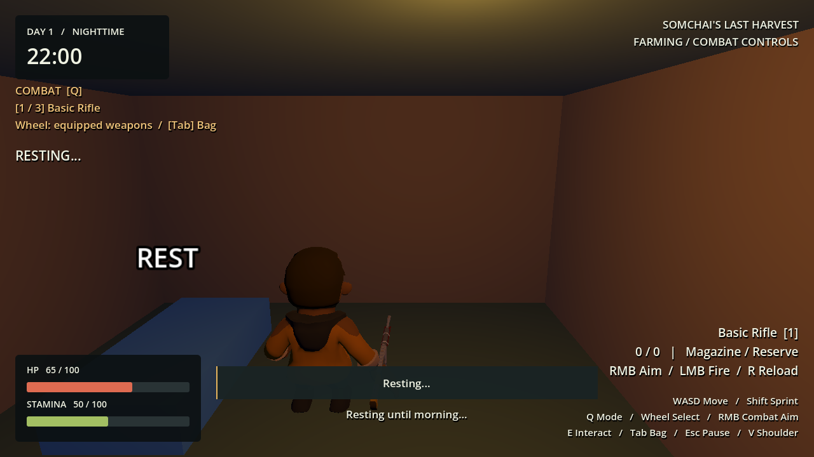
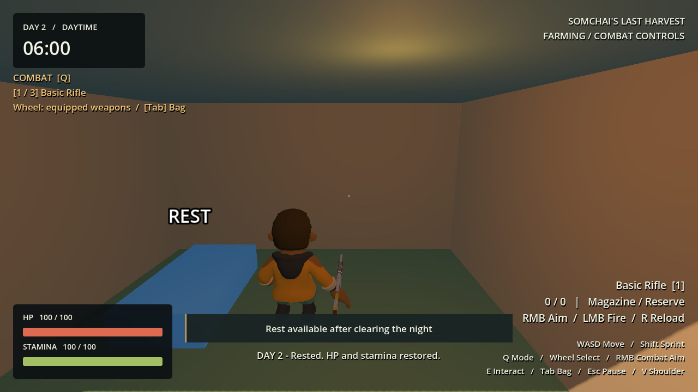
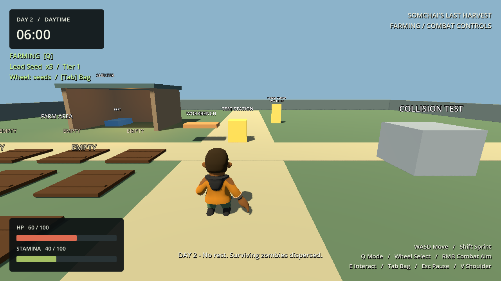
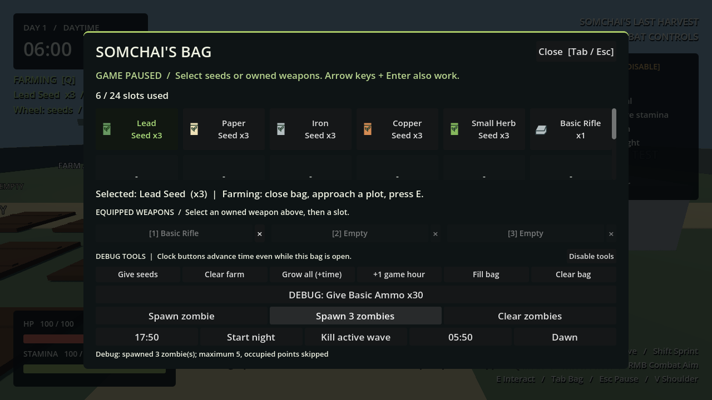

# Phase 7 — Night Wave & Survival Loop

Godot 4.7.2 / Compatibility, 2026-09-30. **Phase 7 complete, runtime verified. All 36 checks pass in their latest runs; two rendered camera checks required unchanged targeted reruns.**

## Night lifecycle and dependencies

`NightWaveManager` owns DAY / ACTIVE / CLEARED / RESTING / GAME_OVER. It subscribes to the existing GameClock `night_started`, `day_started` and `time_changed`; it does not own another day timer. The clock script was not changed. Only the spawn cadence and brief rest presentation have local timers.

At 18:00 it starts the configured wave once for that survival day. A monotonic last-started-day guard prevents duplicate signals or backward debug seeks replaying that night. At 06:00 both natural dawn and rest arrive at the same `_on_day` cleanup/reset path. GameClock owns the day increment and `new_day_started` event; the manager never increments a separate day counter.

`NightWaveData` (`resources/waves/day_1.tres`) defines day, normal zombie count, spawn interval, minimum player distance and zombie scene. Validation rejects missing scene/invalid counts/timing. This is one prototype configuration reused on later nights, including Day 2; no day difficulty progression is implemented.

## Spawn architecture and tracking

`ZombieSpawnFactory` extracts the existing navigation/occupancy checks from the debug spawner. Both debug spawning and waves reuse it. Production wave instances are separate from the debug tool's list and five-instance limit. The wave manager decides cadence and count; each zombie still owns its AI.

`MainWorld/WaveSpawnPoints` contains North (0, -20), East (20, 0), South (0, 20), West (-20, 0), listed as X/Z. Deterministic round-robin selection distributes enemies across directions. Each attempt checks the minimum distance, projects to nearby navigation ground, rejects points more than 1 m from the mesh and checks a capsule against World/Player/Enemy. Blocked points are skipped; if none are safe the pending spawn is retried later. Map marker visuals now follow the debug visibility toggle.

Wave zombies set `pursue_target=true` so distant attackers actually approach the player beyond the normal 12 m detection radius. Debug zombies retain their local detection behavior. This is the only chase condition added to AI; no zombie state or weapon rewrite was required.

The manager stores instance-ID dictionaries for living enemies and all tracked instances (including death-animation corpses). Signals update these collections; no per-frame scene scan. `remaining = total - spawned + alive`. A death removes its living entry once, immediately updates HUD, then checks **all spawned AND none alive**. Pending enemies prevent premature clear. Delayed corpse removal does not count as a second kill. Unexpected removal of a living enemy returns it to pending for replacement, rather than granting clear credit.

## Rest, dawn and plants

`ShelterBed` reuses the existing E interaction system. The blue prototype bed is inside the shelter at (-10.5, 0, -7). It explains why rest is unavailable during daytime/active waves, and offers **Rest until morning** only after a clear at night.

`RestSystem` validates the actor and clear state, enters RESTING once, zeroes velocity, cancels aim/weapon actions through the existing control gate and pauses gameplay. After 0.35 seconds of presentation it heals existing HP to max, resets existing stamina and calls `GameClock.skip_to_day()`. Time jumps directly to next dawn without simulating every minute. Controls and pause are restored afterward. Death during the delay aborts without healing, advancing the day or leaving the tree paused.

Plants already use GameClock elapsed timestamps and clock signals. Rest therefore advances growth by the skipped duration without resetting farming or manually ticking plants. A planted crop before a 22:00 rest becomes ready at 06:00 in the lifecycle test.

**DEMO DESIGN DECISION:** at natural dawn, unfinished wave zombies despawn so the daytime farm is usable. State is switched out of ACTIVE before cleanup; tracking is cleared, AI/attacks and collision are disabled immediately, then nodes are queued for removal. Administrative despawn emits no combat-death reward or wave-clear event. Pending spawns and counters reset. No HP/stamina rest bonus is applied. Ordinary stamina recovery still works normally; the bad-night test spends stamina near dawn to verify no sleep refill occurs.

Clearing a night does not automatically heal or skip time: the player must use the bed before dawn. If they wait until dawn, the same no-rest transition applies.

## Game over, restart and HUD

Player death enters GAME_OVER, stops new spawns, pauses GameClock and administratively removes tracked wave enemies. Existing HP/control locks and game-over HUD remain. Rest is rejected. R reloads the main scene and returns to Day 1 / 06:00, full HP/stamina, fresh farm, initial inventory/rifle and empty wave tracking.

HUD adds a left-side night label outside the crosshair: remaining enemies, alive/pending counts, NIGHT CLEARED/rest availability and RESTING. Existing day/time, stats, mode and ammo remain. Feedback warns at 17:00, announces night start and states whether the next day began rested or without rest.

Debug bag tools add **17:50**, **Start night**, **Kill active wave**, **05:50**, **Dawn** behind the existing debug gates. Kill active wave only kills currently spawned enemies; pending enemies remain pending and cannot be bypassed to earn rest. With the existing clock ratio, 17:50 to 18:00 takes about 8.33 real seconds at normal speed. Debug seek backward will not replay a completed/started night; use a new day or restart for another trial.

## Temporary balance and scene changes

| Setting | Value |
|---|---|
| Wave | Normal Zombie ×6, one main wave per night |
| Spawn interval | 2 seconds; blocked attempts retry |
| Minimum distance | 12 m |
| Zombie HP / rifle damage | 100 / 20; five hits each |
| Minimum perfect-hit ammo for wave | 30 rounds |
| Rest | Full HP/stamina, 0.35 s presentation, skip to next 06:00 |
| Day/night duration | Existing 600 real seconds each at ×1 |
| Navigation | Rebaked with solid bed: 63 polygons |

New scripts: NightWaveData, NightWaveManager, RestSystem, ShelterBed, ZombieSpawnFactory. New assets: Day 1 wave Resource and Bed scene. GameRoot wires dependencies, MainWorld adds bed/markers, HUD adds night display, debug UI adds controls. Existing spawner delegates creation to the shared factory; NormalZombie adds wave pursuit and administrative despawn. No original art, weapon core, farming, crafting, player movement or GameClock implementation was replaced.

## Runtime tests

Baseline Phase 6 passed before edits. The old 25-run headless regression also passed after initial integration.

`phase_7_lifecycle_test.gd` (headless + rendered) checks:

- 18:00 automatic night start, duplicate-event guard, no forced Combat mode, six total including pending, safe distant spawns and multiple directions.
- Zero alive with pending cannot clear; actual deaths clear once after all have spawned; HUD/rest availability.
- Daytime/active/rest-repeat rejection, physical E bed, aim/weapon lock, full recovery, exact day increment and plant time skip.
- Natural dawn without restoration, immediate safe enemy disable/removal, no false clear, no retroactive rest.
- Unexpected deletion replacement, all spawn points blocked/retried, game-over spawn/clock stop, R fresh-scene restart.
- Death during rest cancellation, backward seek idempotence, unchanged Day 2 wave and invalid data rejection.

`phase_7_full_day_test.gd` uses the production clock at ×1 with fixed simulation deltas. It drives walking/sprinting, wheel seed selection, E, crafting UI clicks, Q/R/RMB/LMB and bed interaction. It does **not** seek/advance the clock, change its duration/scale, teleport the player, grant items/ammo, alter zombie HP or heal the player. Headless execution runs those normal simulation frames faster than wall time; this is not a manual 20-minute playtest.

**Full Day 1 result:** plant and naturally harvest two Lead, two Paper, two Copper and two Small Herb crops; craft 40 Basic Ammo and one Basic Medicine; naturally reach 18:00; receive an actual melee hit; kill six zombies using 30 rifle shots and real reloads; walk to bed and press E. HP before rest was **90**, afterward HP/stamina **100/100**, Day **2**, time **06:00**. Medicine remains a crafted inventory item; its consumption behavior is still deferred from Phase 4.

**Bad-night result:** a fresh unprepared Day 1 naturally reaches night, receives melee damage and runs around the prototype perimeter until dawn without killing the wave. Day **2** starts with **HP 70**, **stamina about 81.67**, no rest, no remaining wave references. Both complete scenarios passed in one focused run (about 55.5 seconds wall time with accelerated headless frame execution, unchanged gameplay timing).

Early fixture failures were a walking destination closer to a plot than the Workbench and the full-day test omitting the standard 1280×720 viewport size for UI clicks. The fixture now approaches the table at (-2, 0, 0.1), sets the viewport and waits for UI layout between clicks. Production interaction/crafting was not altered to bypass these issues.

Run all tests:

```powershell
.\tests\run_tests.ps1 -Godot 'C:\path\to\Godot_v4.7.2-stable_win64_console.exe' -WithRendering -LogDirectory '.godot\test-logs\phase7_final' -CaptureDirectory '.godot\test-captures\phase7_final'
```

Final verification: **36/36 checks pass in the latest logs** (editor import, 25 headless scripts, main boot, 9 rendered checks). The initial combined runner returned failures=2 for rendered camera-controls and camera-walkthrough assertions; each passed when rerun unchanged in isolation. The cause of this inconsistency was not isolated, and no production camera change was made. This is not a claim of an uninterrupted clean batch. Latest logs contain no remaining assertion/script/runtime error. The existing Windows certificate-store exception remains unchanged. Natural rendered Lead growth took30.381real seconds; full-day simulation took50.582wall seconds in this run. [Per-check summary](docs/phase7/test_results.json). Logs are local ignored artifacts. Full-day simulation has a 180-second runner timeout; ordinary checks retain 60 seconds. Rendered lifecycle evidence uses controlled clock seeks/damage to inspect edge cases and HUD; the separate full-day simulation supplies the no-cheat gameplay evidence.

## Known issues, debt, performance and Phase 8

No functional failure remains in the latest focused/regression runs. Rendered camera tests showed the inconsistent initial results described above; retain that test stability caveat. Final lifecycle/debug UI screenshots were visually inspected. No export, human long-session test or FPS benchmark was performed. Spawn work is limited to one interval attempt and four point queries; the manager tracks signals rather than scanning the tree. Corpses and pending counts have separate lifetimes and are cleared at dawn/game over.

Prototype choices: placeholder blue bed, no sleep animation/fade/audio, static navigation (rebake after geometry changes), capsule-only damage, no crowd avoidance. Off-screen spawn filtering is not implemented; minimum distance and occupancy are enforced. Night lighting and player gun animation limitations remain from earlier phases. A fully blocked spawn area keeps pending enemies until a safe point opens or dawn; it never awards a false clear.

Phase 8 can supply per-day wave data and unlock rules through the existing `new_day_started` event. **Day 1–10 progression, Runner, Tank, seed/recipe unlock progression, bosses and rescue ending were not started.**

## Rendered evidence












