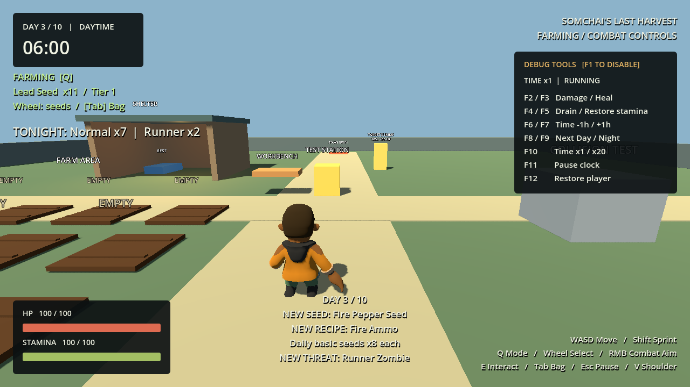
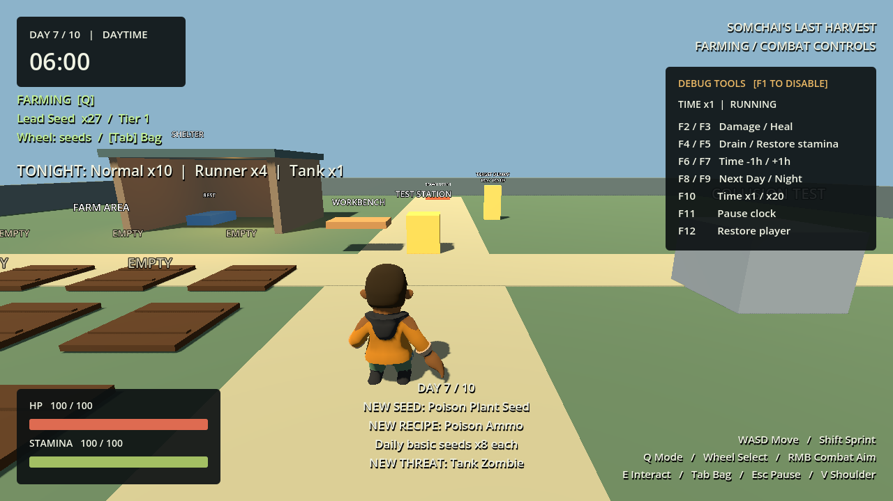
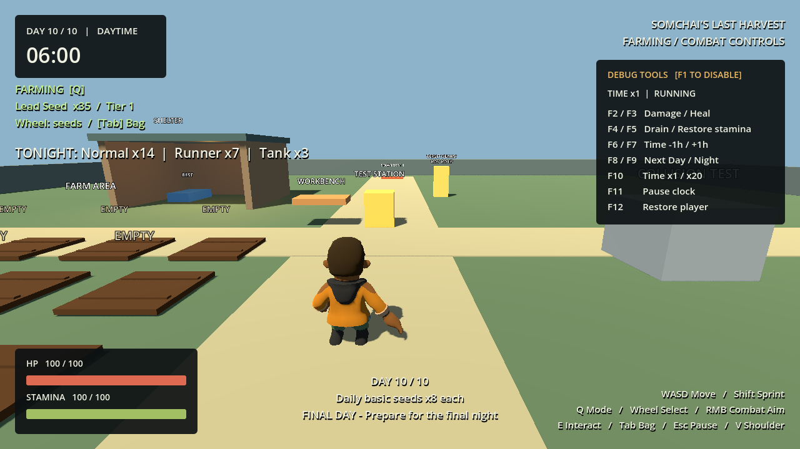
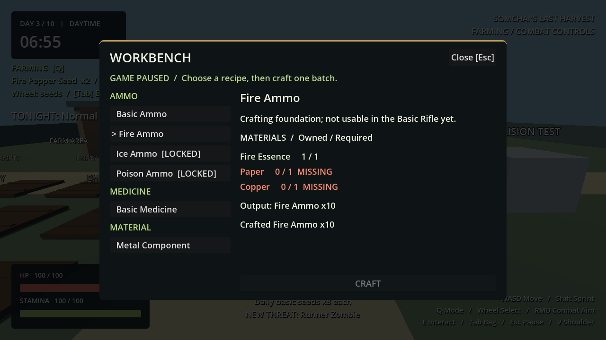
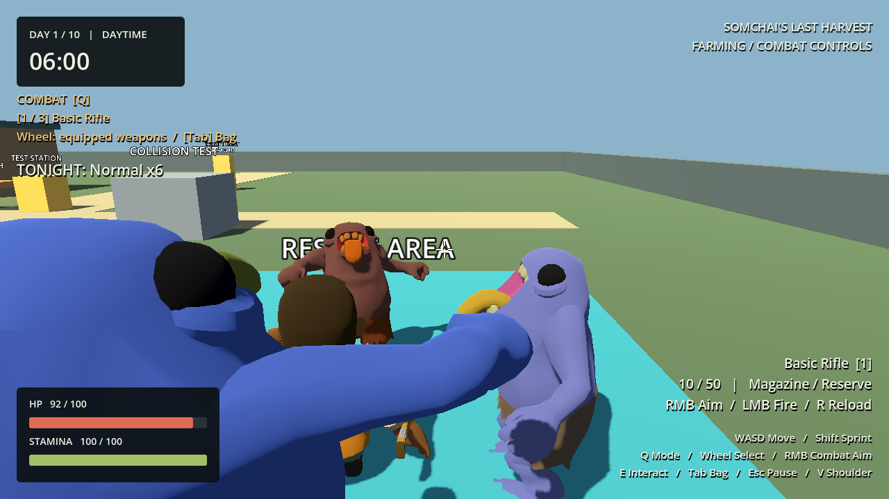
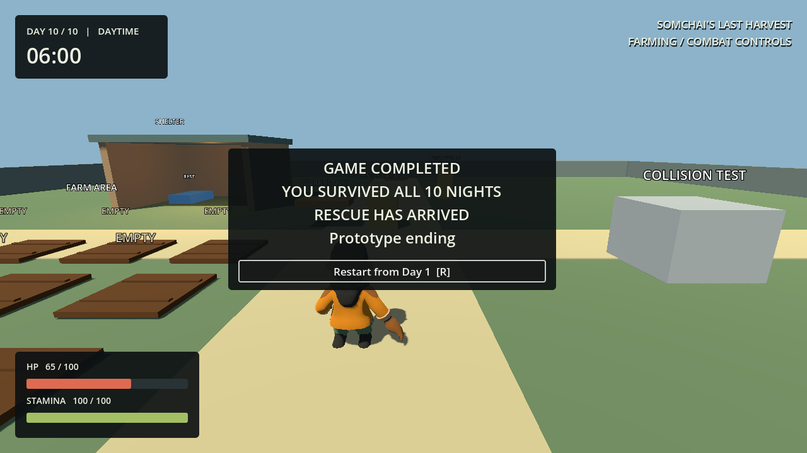

# Phase 8 - Day 1-10 Progression, Enemy Variants and Content Unlocks

Godot 4.7.2 / Compatibility, 2026-09-30. Phase 8 complete, runtime verified. All 40 checks pass in their latest runs; the initial batch had four failures fixed before targeted reruns.

## Progression and DayConfig architecture

`GameRoot` creates and binds `ProgressionManager` to the existing clock, inventory, catalog and recipe book. `resources/progression/ten_days.tres` references ten independent `DayConfig` resources. Each config owns the day, wave resource, new seed/recipe IDs, starter reward, daily seed supplies and introduction message. The manager only applies content state, grants rewards and publishes feedback; farming, weapon and enemy behavior stay in their existing systems.

`day_started` applies progression for both natural/rest dawn and explicit debug seeks. The clock also retains its original `new_day_started` signal for actual dawn transitions. Forward day jumps apply missed unlocks; backward jumps retain earned content. Reward receipts, reached days, unlocked IDs and owned inventory quantities are separate. Duplicate day events neither grant supplies nor announce unlocks again. No save persistence is added.

Validation checks all ten days, missing/duplicate configs, wave/day correspondence, enemy scenes and tuning, counts/timing, seed IDs, recipe IDs, matching recipe unlock days and duplicate unlock declarations. Missing configuration produces an explicit `Missing DayConfig for Day N` diagnostic; invalid waves cannot begin.

## Full progression / wave composition table

All values are temporary balance. Maximum living wave enemies: 12. Minimum spawn distance: 12 m. Existing four cardinal markers remain.

| Day | Normal | Runner | Tank | Interval (s) | Seed unlock | Recipe unlock | Notes |
|---|---:|---:|---:|---:|---|---|---|
| 1 | 6 | 0 | 0 | 2.0 | Lead, Paper, Iron, Copper, Small Herb | Basic Ammo, Basic Medicine, Metal Component | Existing starter loadout, three of each seed |
| 2 | 7 | 0 | 0 | 1.9 | - | - | Begin daily basic seed supplies |
| 3 | 7 | 2 | 0 | 1.8 | Fire Pepper | Fire Ammo | NEW THREAT: Runner |
| 4 | 8 | 3 | 0 | 1.7 | - | - | More mixed pressure |
| 5 | 9 | 4 | 0 | 1.6 | Ice Plant | Ice Ammo | Tier 3 materials |
| 6 | 10 | 5 | 0 | 1.5 | - | - | Midgame mixed wave |
| 7 | 10 | 4 | 1 | 1.4 | Poison Plant | Poison Ammo | NEW THREAT: Tank |
| 8 | 11 | 5 | 2 | 1.3 | - | - | More Tank pressure |
| 9 | 12 | 6 | 2 | 1.2 | - | - | High threat |
| 10 | 14 | 7 | 3 | 1.1 | - | - | FINAL DAY / final mixed night |

Day 1 deliberately retains six Normal Zombies so the previously verified farming/ammo/night loop remains intact. No daily HP inflation. Water/Electric plants and weapon unlocks are optional scope and were not added.

`NightWaveData.composition` contains `WaveEntry` scene/count pairs. Its queue cycles through nonempty entries, mixing variants from the start, then drains the remaining counts. The manager consumes one queued scene per successful spawn. A full living cap or blocked marker preserves pending entries. Remaining = living + pending; empty living population with pending spawns cannot clear. Unexpected living deletion returns the exact scene type to the queue. Administrative cleanup removes pending, alive, corpse and scene-reference collections.

## Runner, Tank, shared AI and inspected assets

| Variant | HP | Speed (m/s) | Damage | Attack interval | Body radius / height | Visual scale / clip |
|---|---:|---:|---:|---:|---|---|
| Normal | 100 | 2.0 | 10 | 1.2 s | 0.38 / 1.8 m | 1.1 / Walk |
| Runner | 60 | 4.5 | 8 | 0.95 s | 0.34 / 1.65 m | 0.98 / Run, warm tint |
| Tank | 300 | 1.5 | 25 | 1.8 s | 0.49 / 2.22 m | 1.35 / Walk, cool tint |

All three scenes use **the same `normal_zombie.gd` controller**, Health, NavigationAgent, windup validation, four AI states and delayed death. The historical class name remains `NormalZombie`; it now represents the shared ground melee controller. Data resources supply tuning, clip names and tint. Tint materials are duplicated per instance; imported files and shared ZombieData are not mutated. Spawn occupancy checks now read the actual scene capsule instead of assuming the Normal dimensions.

Inspected the original GLB JSON: Zombie.glb has three meshes and 16 clips including actual `CharacterArmature|Run`, Idle, Walk, Punch and Death. Zombie-VlXjG0N8Eg.glb has two meshes and 32 clip entries; Big arm.glb has one mesh and 14 clips. This phase intentionally reuses the already integrated Zombie.glb with scale/tint differences rather than integrating two additional rigs. These are placeholder silhouettes, not final variant artwork. Runner uses the real Run clip, not accelerated Walk. Tank's radius fits the existing 0.5 m navigation clearance; runtime obstacle and shelter routing pass. Existing shelter roof clearance accommodates its taller collider; navigation is static and must be reviewed if geometry changes.

## Seed rewards, inventory safety and resource availability

New seed unlocks grant **three** once. Day 1 seeds are already supplied by the starter loadout and have zero additional unlock reward. Days 2-10 each supply **eight of each of the five basic seeds**, once per reached day. This explicit demo supply rule addresses the finite starter-seed economy: without replenishment, later farming would stop. Skipped days in a debug jump do not accumulate missed daily supplies.

Unlocked seeds are stored independently of inventory quantities. The selector requires both an unlocked ID and an owned plantable seed, and retains tier/order sorting. A locked seed injected into inventory cannot be selected. Full-bag rewards stay in `pending_rewards`; inventory changes retry atomic delivery. Reentrant inventory signals are guarded. The daytime HUD tells the player to make room; repeat day events cannot duplicate a queued reward. Debug reset changes availability without deleting items or resetting reward receipts.

Eight crops of each Lead, Paper and Copper (24 crops total) can supply 160 Basic Ammo per day at current yields, before carryover. Night 10 needs 136 perfect-hit rifle rounds (70 Normal + 21 Runner + 45 Tank). This is an economic feasibility calculation, not proof of balanced combat or a manual ten-day survival run. Twelve plots support repeated crop batches during the existing ten-minute daytime. Medicine remains craft-only as in prior phases.

## Plant progression and recipes

| Plant | Day / tier | Growth at normal clock | Harvest | Recipe ingredients -> output |
|---|---|---|---|---|
| Fire Pepper | 3 / 2 | 45 s (54 game minutes) | Fire Essence x2 | Essence x1 + Paper x1 + Copper x1 -> Fire Ammo x10 |
| Ice Plant | 5 / 3 | 45 s | Ice Crystal x2 | Crystal x1 + Paper x1 + Copper x1 -> Ice Ammo x10 |
| Poison Plant | 7 / 3 | 45 s | Poison Extract x2 | Extract x1 + Paper x1 + Copper x1 -> Poison Ammo x10 |

New plants reuse the common growth stages and NaturePlantVisual with distinct produce colors. Catalog now contains 23 items and eight plants; recipe book has six recipes. Recipe availability uses the progression registry, independently of ingredient quantity. Locked recipes remain visible with `[LOCKED]`; both the UI and crafting transaction use the same gate. `unlock_day` remains validated metadata and a fallback for isolated crafting-system fixtures without a progression manager.

**Special ammo scope is prompt option A: unlock + item + craft only.** Fire/Ice/Poison rounds cannot be loaded into the Basic Rifle. Their item/recipe descriptions say so. Ammo selection, damage effects, slow and damage-over-time are deferred. There are no new weapons. This is a documented limitation, not a claim of usable elemental combat.

## HUD, debug and completion

HUD shows `DAY X / 10`, a daytime threat preview derived from the actual wave resource, night alive/incoming counts, queued reward notice and unlock/enemy introduction messages. Day 10 announces FINAL DAY. Debug bag has one compact dropdown for Day 1/3/5/7/10 jumps, unlock all seeds/recipes and reset unlocks to the current day. Existing debug gates and night tools remain. Day jump safely clears old wave state before seeking 06:00.

Clearing Night 10 enters CLEARED and still permits bed rest. Completion occurs at **the dawn after Night 10**, either through earned rest or natural survival with living/pending enemies. Natural dawn does not heal. The clock internally reaches story Day 11 at 06:00; HUD retains Day 10/10 and the game enters terminal `GAME_COMPLETED`, with no Day 11 content or gameplay wave.

Completion stops the clock, despawns enemies, empties pending/corpse tracking, disables player and gameplay menu processing, cancels weapon controls and displays **GAME COMPLETED / YOU SURVIVED ALL 10 NIGHTS / RESCUE HAS ARRIVED**. R or the restart button reloads a fresh Day 1 with fresh unlock/reward state. No rescue scene, cinematic or credits is implemented. Ordinary death on any playable day retains GAME_OVER and restart.

## Runtime tests and regressions

Before editing, the prior Phase 7 lifecycle and full-day runtime tests passed. The full-day test used production clock/input and no debug grants, healing, teleports or kill cheats: farm/craft, kill six through the rifle, rest with HP90 ->100; failed-clear survival reached natural Day2 HP70/stamina81.67. Baseline full-day wall time was54.56s under faster-than-wall-time fixed simulation.

New `phase_8_progression_test.gd` exercises:

- Validation including missing Day6, existing Day1 reward identity, locked-owned seed and recipe gates.
- Debug smoke Day1/3/5/7/10: config/HUD, duplicate event notification/reward checks, exact actual spawned composition and pending-aware clear.
- All three magical seed rewards, selection, planting, timestamp growth, correct harvest, actual Workbench UI craft and output.
- Full bag delivery retry and duplicate protection; debug unlock/reset/reach semantics.
- Twelve-active cap with twelve pending on Day10, exact Tank replacement after unexpected removal.
- Final clear waits for rest/dawn; final rest completes and releases pause without reopening gameplay.
- Final natural dawn wins with unspawned/live enemies, no healing, cleanup, clock/menu/fire lock and R restart.
- Accelerated clock-driven Day1 ->10 -> completion; exact ten dawn events, no duplicate registries, persistent farm/inventory/magazine, empty final tracking.

Composition/cap fixtures accelerate spawning and use direct damage or frozen/repositioned enemies to isolate lifecycle rules. They are not balance playtests. The accelerated ten-day sequence instead uses **three real simulation seconds per half-day**, normal spawn cadence, no day seeks, enemy kills or player healing. Short nights limit the observed peak to three tracked enemies; the separate cap fixture and mixed combat test cover larger populations. It verifies accumulated state, not three hours of survival difficulty.

Ten-day headless observation: daytime node counts **422 on every day**, ending426 including the completion UI; playerHP100; dawns[2,3,4,5,6,7,8,9,10,11]; no active/pending/tracked entries at completion. Static memory approximately58.3MB in that focused run. These are process observations, not target-hardware FPS measurements.

New `phase_8_variants_test.gd` measures each variant's movement, HP, actual animation clip, melee damage and navigation; Tank routes around the solid box and shelter entrance; actual sprint input escapes three Runners. Mixed **2 Normal +1 Runner +1 Tank** independently navigate and attack while the real Rifle aims, fires and reloads. Verified hits: Normal10 total, Runner3, Tank15; all four clean up. The observer fixture heals the player during sustained mixed attack to inspect every enemy and reload; this is not default invulnerability. No special-ammo effects are claimed.

Latest regression: **40/40 checks pass** (editor import +27 headless scripts +main boot +11 rendered checks). Initial batch returned `SUITE_RESULT failures=4` for Phase2 integration, Phase3 farming, Phase3 extension and Phase4 crafting. The fixes are described below; all four targeted headless reruns passed, and corresponding rendered tests passed. Final focused rendered Phase8 was rerun after terminal HUD cleanup and passed. This is not a claim of one uninterrupted green batch. No remaining assertion/script/runtime errors in latest logs; existing Windows certificate-store diagnostic exception is unchanged. Natural rendered Lead growth was30.403s. Local logs: `.godot/test-logs/phase8_final/`; portable summary: [test_results.json](docs/phase8/test_results.json).

Visual inspection confirmed readable Day3/Day7 seed, recipe and enemy messages, the actual threat preview, Workbench locked/unlocked rows, distinct scaled/tinted mixed enemies and the terminal completion panel. Completion hides stale gameplay/debug hints and prior-day notifications. Rendered automation is not manual playtesting.

```powershell
.\tests\run_tests.ps1 -Godot 'C:\path\to\Godot_v4.7.2-stable_win64_console.exe' -WithRendering -LogDirectory '.godot\test-logs\phase8_final' -CaptureDirectory '.godot\test-captures\phase8_final'
```

## Bugs fixed, balance, debt and performance limits

- Preserved the deleted enemy's exact variant in pending replacement, avoiding composition drift.
- Spawn clearance now matches the variant capsule; cap fixtures must move frozen enemies away from their spawn markers to permit subsequent occupancy-checked spawns.
- Full-bag reward delivery guards synchronous inventory callbacks and preserves receipts through debug unlock resets.
- An initially broad terminal debug guard blocked the existing F12 health-restore fixture after death; it now globally blocks GAME_COMPLETED while retaining existing GAME_OVER-specific wave guards.
- Old regression expectations were updated for eight plants/23items/sixrecipes/Day2 seven Normal. The malformed-seed fixture explicitly unlocks its test seed to reach plant-data validation. The dynamic recipe fixture registers its unlock in Day2 data. Production gates were retained.

Enemy balance, eight daily basic seeds, growth/yields and wave timings remain placeholders. Runner speed4.5 is below sprint7 but above ordinary walk4 and aimed walk2.8. No final balance claim; aimed movement needs sprint/reposition decisions. Tank takes15 perfect rifle hits, not minutes of uninterrupted shooting. No human ten-day survival test or exported-build benchmark was performed.

Technical debt: elemental ammo use/effects, final variant models/icons, medicine consumption, crowd avoidance, final art/audio, dedicated player aim/reload animation, save persistence and rescue presentation. Static nav remains63polygons, no dynamic baking. Signal-based wave tracking and throttled AI target refresh remain; living cap12 bounds pursuit load, while death-animation corpses can briefly exceed that node count. Full long-run real-time FPS remains a Phase9 measurement task.

## Phase 9 readiness / stop boundary

The ten-day content progression and prototype victory are ready for **Phase 9 - Final Night Ending, Rescue, UI/UX & Game Polish** on the next user prompt. Ending hook is `NightWaveManager.completed`. No Phase9 cinematic, rescue scene or polish scope has been started. Stop after reporting and pushing Phase8.


## Rendered evidence












