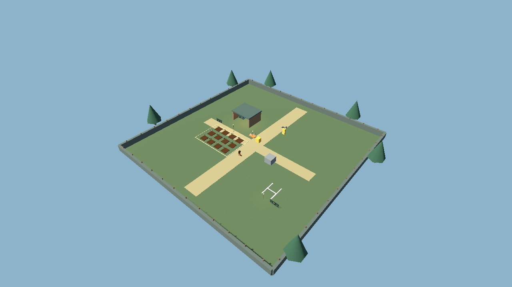
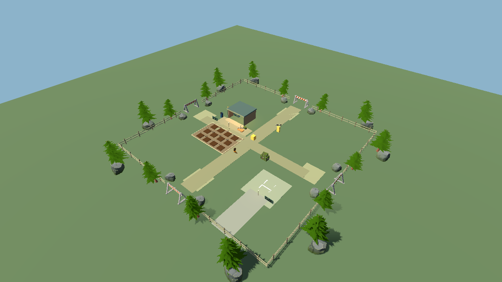
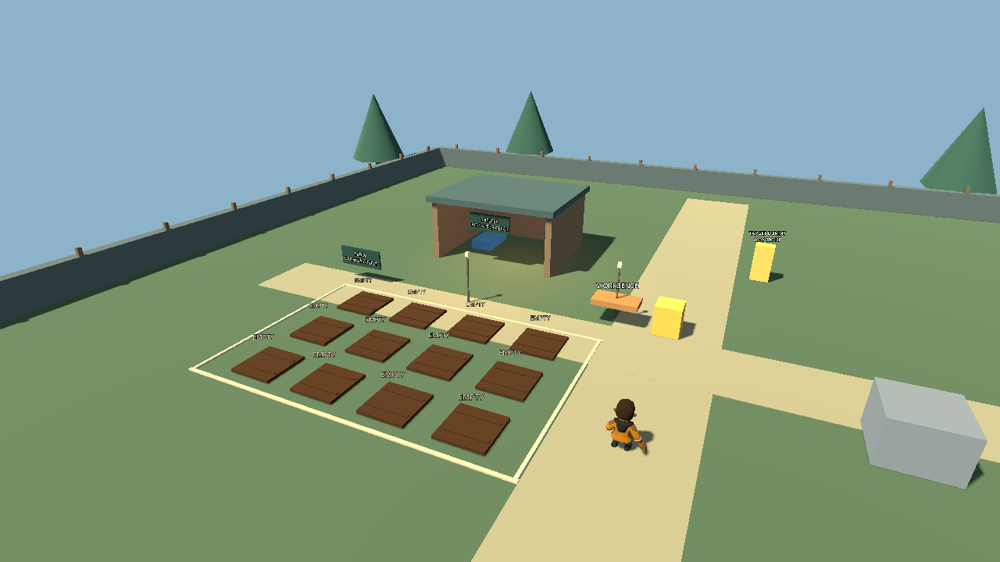
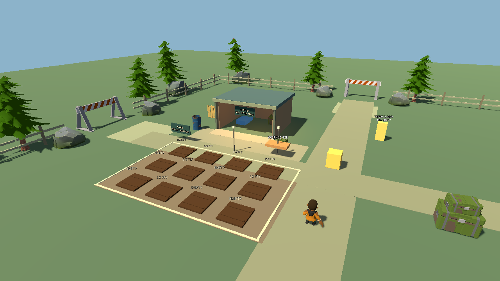

# Post-production Refinement Pass 1

**Completed: 2026-10-01. Current stage: COMPLETE / STOP.**

Scope: map → movement → holding → aim → confirmed Skip to Night → full regression. Existing gameplay systems, balance and original assets are retained. Source baseline: `6a0859c1a161069f2e7b77f8d7522fe042495ff0` (clean checkout at start). No commit or push was made. The old Phase 10 EXE/PCK was not rebuilt; use Godot 4.7 / Compatibility to run the current source.

## Stage gates

| Stage | Result and gate before advancing |
|---|---|
| A — Map | Passed routes for all three enemy types, player access, camera, farming/combat and presentation. A later full regression found a pallet navigation trap; it was fixed and the affected gates rerun. |
| B — Movement | Audited real rig and clips; movement, camera controls and 30/120 Hz tests passed. |
| C — Holding | Both grips, farming/combat visibility, switching, weapon and crafting regressions passed. |
| D — Aim | Vertical aim, strafe/backward, barrel alignment, grip error, recoil/reload and mixed combat passed. |
| E — Skip | Confirmation, pause/input, elapsed growth, same-day night transition and edge cases passed headless and rendered. |
| Final integration | Latest 52/52 per-check results pass after one headless fixture correction. Full finite-resource 10-day campaign reaches rescue. Final rendered boot and profiling pass. |

## 1. Map before / after

Before: a 48 × 48 m playable plane with plain perimeter walls, isolated shelter, uniform ground and primitive trees. The farm spacing and eastern combat lane already worked. The workbench sat apart from the base and the rescue marker had little surrounding context.

After: retain that map and its working anchors, connect shelter/farm/crafting with a dirt yard, add a porch and supplies, frame the four approaches with fences/rocks/pines, and give the rescue clearing a road. The open combat area remains deliberately sparse. An exterior ground skirt fills the horizon; it is scenery outside the safety boundary.

| Before | After |
|---|---|
|  |  |
|  |  |

These comparison captures use direct GameRoot test entry, so the old target dummy is visible in both. Normal MainMenu Play removes it. The small yellow interaction test cube remains an inherited prototype object; replacing its appearance is future cosmetic work.

## 2. Layout decisions

Coordinates below use world X/Z metres.

| Anchor | Decision |
|---|---|
| Play space / boundary | Keep 48 × 48 m, safety walls at ±24. Dress with fencing and blocked roads. |
| Player spawn | Keep (0, 6). |
| Farm | Keep all 12 plots, X -4…-11.8 / Z 2…7.2, with clear interaction lanes and soil surround. |
| Shelter / bed | Keep shelter X -12…-6 / Z -9…-4 and bed (-10.5, -7); add porch, fascia and supplies. |
| Workbench | Move (-2, -1) → (-4.5, -1), closer to farm and shelter without blocking entry. |
| Combat cover | Keep the existing block at (7, 3), dress its visual as stacked supply chests. |
| Wave entries | Keep (0, -20), (20, 0), (0, 20), (-20, 0), with the existing 12 m minimum player clearance. |
| Rescue | Keep (13, 10), add open clearing/road; sign says rescue is after Night 10. |

Density is highest around the base, lighter along transitions, and low in combat approaches. Existing base/field/landing lighting is retained, with the workbench light following its new position. No extra lights or particles were added. [Night view](docs/refinement1/after/map_night.png).

## 3. Props and asset handling

`MainWorld/FarmDressing` builds static scenery from explicit existing dependencies:

- `Asset/Post Apocolypse Pack.undefined-glb/`: Chest, Barrel, Pallet, Traffic Barrier.
- `Asset/Stylized Nature MegaKit.undefined-glb/`: Pine, Rock Medium.
- `Asset/Survival Pack-glb/`: Shovel.
- Project geometry: ground patches, fence posts/rails, porch, shelter fascia and trim.

Bounds-normalized wrappers control size and orientation. Base supply props and eight entry rocks have simple static box colliders. Exterior vegetation/rocks, ground markings, signs and tools are decorative. The field supply stack retains the existing block collider. Chests do not add a storage mechanic. Explicit preloads and the updated export dependency list prepare these assets for a later build.

**All 243 original GLBs match their pre-pass SHA-256 hashes**, including the character, weapon and imported animations. [Asset audit](docs/refinement1/asset_audit.json). Source/license metadata for the original packs is still missing; see ASSET_CREDITS.md.

## 4. Navigation changes

Rebaked the existing navigation resource from the same runtime map, including new solid props. Final bake: **149 polygons**, agent radius 0.5 m / height 1.8 m. Existing navigation and enemy movement logic are unchanged.

Coverage: Normal, Runner and Tank × four spawn markers × two destinations (open field and shelter) = **24 routes**. Also tested actual player movement to all 12 plots, workbench, bed and rescue. A separate rear-shelter Tank probe covers the newly discovered pallet corner.

The initially horizontal pallet produced a climbable navigation surface, while the CharacterBody controller has no step-up. Store the pallet upright and widen its wall-side gap; rebake and rerun routing and mixed-variant combat. These now pass. The isolated stationary-player routing probe disables damage so player death cannot invalidate the route measurement; actual combat tests remain separate.

## 5. Camera results

The map adds no camera algorithm changes. Existing ray collision, corner/wall walk-through, shoulder, aiming and return-to-normal tests pass. New map tests take **120 camera clearance samples** around the farm, shelter and props. Farm interaction and all anchor paths remain reachable. Rendered over-the-shoulder gameplay and night views were inspected. This verifies sampled routes rather than every possible camera angle.

## 6. Character movement / animation

Inspected actual Matt rig: **43 bones, 20 AnimationPlayer clips, no AnimationTree**, authored +Z forward; effective imported/wrapper scale 110 (100 × 1.1). `Middle1.L/R` originate at the wrists; there are no separate Hand bones. `Foot.L/R` are Root siblings of Body. Audit tool and [raw rig evidence](docs/refinement1/logs/focused/rig_audit.log) are retained.

PlayerVisual now selects the imported Idle/Walk/Run clips for Farming and Idle_Gun/Walk_Gun/Run_Gun for equipped Combat. `current_state` stays compatible with existing consumers; `current_clip` records the selected clip. Playback speed follows actual horizontal velocity; backward aiming reverses the walk cycle. Transitions blend over 0.10–0.16 s. Movement speed, sprint/stamina, input responsiveness and physics root remain unchanged; animation does not drive locomotion.

## 7. Weapon holding

The original one-arm Gun clip left the old right-wrist rifle hanging. A small `RiflePose` SkeletonModifier3D now applies after the imported clips, with a two-bone solver for each arm and explicit grip targets. A unit-scale WeaponSocket keeps rifle scale independent of the imported skeleton scale.

BasicRifle model scale is 0.5 (previously 0.6). Socket-local markers: primary grip (0, -0.10, -0.045), support grip (0, -0.04, 0.20), magazine grip (0, -0.09, 0.04), muzzle (0, 0.1017, 0.5125). Tests require wrist-marker errors below 0.025 m. Switching replaces the old visual immediately while preserving existing per-weapon magazines and selection semantics.

[Ready pose](docs/refinement1/after/pose_ready.png) · [Aim pose](docs/refinement1/after/pose_aim.png). This is a stylized two-hand approximation; finger articulation and perfect mesh contact are not authored.

## 8. Item / tool holding

Production has one usable firearm: Basic Rifle. There is no usable pistol, shotgun or equippable farming tool to pose. Test-only alternate weapon data remains outside the catalog. Farming hides the rifle and uses the relaxed movement clips; Combat shows a lowered ready pose until RMB.

Seeds remain selection/UI items. Medicine and elemental ammunition remain craft-only as before. No oversized handheld model was invented for every inventory item; the shovel is scenery. [Farming stance](docs/refinement1/after/pose_farming.png).

## 9. Aim pose

RMB blends to aim in about 0.083 s. Bounded visual yaw (±70°) and vertical pitch (45° up / 60° down) adjust the socket, with partial torso rotation while the physics capsule remains upright. For ordinary-distance targets the visible barrel converges on AimPoint from the muzzle. Very close or behind-barrel targets use a bounded forward hold to avoid folding into the character; gameplay hit resolution stays authoritative.

Lower Body plus Foot roots turn toward strafe motion (up to 70°); torso counterposing keeps the upper body aimed. Backward movement uses the reversed walk clip. Five vertical angles (-60, -30, 0, 30, 44), both strafes and backward movement passed. Measured barrel/target dot product was at least **0.99976** in the sampled cases. Existing crosshair, cover, close muzzle, range and camera tests passed.

[Aim up](docs/refinement1/after/pose_aim_up.png) · [Aim down](docs/refinement1/after/pose_aim_down.png).

## 10. Shooting / reload pose

Shots still apply immediately. A procedural visual kick adds up to 2.5° and 0.035 m recoil, returning in about 0.11 s before the next 5 Hz shot. Existing fire cadence, damage and ammunition logic are unchanged.

Reload uses the actual 1.5 s weapon timer to lower/roll the rifle and dip the support hand toward the magazine. It cannot award ammunition early. This is a procedural placeholder with no authored magazine removal/insertion sequence. Reload, spam, interruption, inventory pause, death and switching regressions pass. [Shot](docs/refinement1/after/pose_shot.png) · [Reload](docs/refinement1/after/pose_reload.png).

## 11. Missing animations

**Animation not available in current assets:** dedicated aim, fire, reload, strafe and farming-tool clips. Existing generic attack clips are not reported as firearm animations. No new authored clips, source animation edits or large animation framework were added. The two-arm pose, torso/leg adjustment, recoil and reload dip are code-driven approximations over imported movement clips. Future authored clips are needed for polished finger grips, reload choreography and footwork.

## 12. Skip to Night architecture

GameRoot creates one `SkipNightDialog` CanvasLayer. The new `skip_to_night` action uses physical **N** and a visible button beside the HUD clock. Eligibility requires Day 1–10 daytime, normal DAY wave state, live player, active gameplay, and no inventory/crafting/pause, reload, rest or ending transition. It does not require ammunition or judge player preparedness.

The dialog owns one pause and interaction gate, using the existing camera menu gate to cancel aim/fire and release the cursor. Confirm revalidates the day/state, guards reentry, closes its pause, and calls **existing `GameClock.skip_to_night()`**. A deferred completion releases the guard. No direct wave-start call, label-only clock change or rest reward is used. Existing clock, crop, wave and balance code is unchanged.

## 13. Confirmation behavior

- Every request opens a modal; pressing N again never confirms it.
- Cancel has default keyboard focus. Enter at default focus cancels; Escape cancels.
- Text states destination 18:00, plant growth, and no automatic harvest/craft/reload/healing.
- Movement, aim, shooting, interaction and other menus are blocked behind the dialog.
- Cancel leaves time/day/crops/waves unchanged and restores gameplay/cursor state.
- Confirm is explicit and protected against duplicate presses or stale state.
- Day 10 says **Begin the Final Night?** with **BEGIN FINAL NIGHT** confirmation.
- Night, game over and ending hide the daytime action. Death/completion while open closes safely.

Rendered bounds and screenshots pass at 1280 × 720 and 1920 × 1080. [Daytime confirmation](docs/refinement1/after/skip_confirmation.png) · [Final Night at 1080p](docs/refinement1/after/skip_final_night_1080.png) · [Updated controls guide](docs/refinement1/after/phase9_controls.png).

## 14. Clock / plant integration

The clock advances to 18:00 **on the same day** and emits its existing time/night signals. Crops calculate growth from their elapsed timestamps; HUD, lighting, audio and NightWaveManager retain their normal subscriptions. No crop loop, wave or daytime progression is duplicated inside the UI.

Focused tests cover 06:00, 12:34 and 17:55, including fractional elapsed time. Crops gain exactly the skipped time; the late five-minute case preserves partial growth. Ready crops are not auto-harvested. Day/HP/rest/ammunition are unchanged at commitment, no full stamina restoration is granted, and the night start signal occurs once. Day 1 starts its normal six-zombie wave; Day 10 starts the configured final wave. Unprepared players can still choose to skip.

## 15. Tests and evidence

**Latest per-check result: 52/52 passed.** This is 38 headless/import/boot checks plus 14 rendered checks. The first combined batch was 51/52: only its headless mouse-capture assertion failed. The fixture now checks actual OS mouse capture only in rendered mode and verifies gameplay control in both modes. The targeted headless rerun and the rendered counterpart pass. The original failing log is retained; this is not claimed as a fresh single-batch 52/52 run.

[Machine-readable results](docs/refinement1/test_results.json) link each check to its actual log. Additional results:

- Navigation: 24 enemy routes, rear-shelter Tank, 12 plots and workbench/bed/rescue paths, 120 camera samples.
- Character/holding/aim: 8 focused movement checks; 12 holding checks; vertical/strafe/backward, grip and barrel alignment; existing 51 weapon and 54 crafting checks.
- Skip: confirmation/cancel/spam/input/menu/death/reload/ending/stale-day, clock/growth, Day 10, 720p/1080p. Headless backend capture differences are explicitly handled.
- Full new flow: real MainMenu Play → farm/harvest → craft 40 ammo and medicine → rifle/aim/practice shot → N/actual Confirm click → six enemies → bed → healthy Day 2. 32 shots; HP 80 before earned rest. Separate unprepared skip scenario reaches natural dawn at HP 70, stamina 81.67 without rest healing.
- Natural-growth rendered regression measures approximately 30 real seconds for Lead. No fixed simulation rate in that check.
- Existing inventory, selection, stamina, camera, hit/cover/reload, enemy variants, progression, death/restart, rescue and menu regressions pass.
- Rendered MainMenu boot, final map capture and four-scenario final profiling pass with exit 0.

### Sustained 10-day campaign

Normal-play source entry, production economy/clock, finite resources and automated movement/farming/crafting/aim/reload/bed input. No clock seeks, skips, teleport, direct kills, grants or healing cheats. Fixed engine deltas speed up wall time. **All ten nights cleared, 723 shots fired, 337 rounds left, rescue ending reached.** This automated precise-aim run is not human difficulty validation or a new release-export test.

| Night | Zombies | Shots | HP after clear | Ammo remaining |
|---|---|---|---|---|
| 1 | 6 | 41 | 100 | 19 |
| 2 | 7 | 39 | 100 | 40 |
| 3 | 9 | 45 | 100 | 75 |
| 4 | 11 | 51 | 100 | 104 |
| 5 | 13 | 59 | 100 | 145 |
| 6 | 15 | 67 | 100 | 178 |
| 7 | 15 | 77 | 100 | 221 |
| 8 | 18 | 100 | 100 | 261 |
| 9 | 20 | 108 | 100 | 313 |
| 10 | 24 | 136 | 80 | 337 |

[Campaign telemetry](docs/refinement1/campaign.json) · [Full campaign log](docs/refinement1/logs/focused/refinement_campaign.log).

### Failures found and resolved

1. Horizontal pallet navigation trap: store upright, widen path, rebake, route/combat reruns pass.
2. Old weapon fixture approached the moved bench from 1.7 m and selected a nearer plot: derive actual bench position and use verified 1.1 m approach; crafting/weapon reruns pass.
3. Initial wrapped modal exceeded screen height: centered container plus explicit wrapped-text width; final 720p/1080p bounds pass. HUD action moved beside the clock.
4. Fixture repairs: missing screenshot output directory, explicitly typed dynamic values, lighting energy assertion/tolerance, click coordinates outside the modal, and headless OS capture condition. Earlier failures are not presented as production failures.

No unresolved functional failure remains in the latest checks. The existing **`ERROR: Failed to read the root certificate store.`** diagnostic appears in this Windows Godot runtime and is retained in logs; it is the only excluded engine error. No new parser, script or gameplay runtime error appears in the selected final checks.

## 16. Known issues / limits

- Procedural pose is tailored to the current Matt rig and Basic Rifle. Large chibi hands, some body/weapon contact and foot sliding remain, especially at extreme poses. Future weapons need their own grip/pose work.
- No authored fire/reload/strafe/tool clips; no usable medicine/elemental ammo or new equipment system.
- Inherited prototype visuals remain in some world objects; props improve readability but this is not finished environment art.
- Original pack license metadata, human difficulty/listening checks and a clean-machine test remain unverified as previously documented.
- UI is checked at 720p and 1080p; arbitrary tiny windows/localization/gamepad end-to-end behavior are not certified.
- The packaged Phase 10 executable is historical. This pass verifies source runtime; rebuilding/exporting was outside this refinement request.
- Automated input and screenshot inspection are not manual playtesting.

## 17. Performance impact

Same installed **Godot 4.7.stable / Compatibility**, NVIDIA **RTX 4060 Laptop GPU**, debug runtime, Dummy audio, 600 measured frames per warmed scenario. The final selected run had no other Godot process running. Values are observed frame intervals in milliseconds (mean / p99), not a guaranteed FPS target.

| Scenario | Before ms | Final ms | Draw calls | Nodes |
|---|---|---|---|---|
| day_720p | 2.097 / 3.146 | 1.366 / 2.501 | 324 → 541 | 520 → 812 |
| final_night_12_alive_720p | 2.995 / 5.106 | 3.028 / 4.714 | 437 → 652 | 1084 → 1376 |
| final_night_12_alive_1080p | 2.873 / 4.390 | 2.575 / 4.544 | 436 → 652 | 1084 → 1376 |
| ending_1080p | 1.527 / 2.263 | 1.330 / 2.330 | 303 → 535 | 533 → 825 |

Final-night 1080p p99 is **4.544 ms** (maximum sampled 5.527 ms), below a 16.67 ms frame budget on this machine. Daytime Godot static memory changes from 58.46 MB to 61.01 MB; final-night 1080p from 67.81 MB to 70.51 MB (decimal MB, not process working set). Extra static meshes increase draw calls and nodes. No new lights or particles, and no speculative optimization was needed for this measured load.

Timing variance does not establish a speedup. Samples are short, the stress fixture disables player damage and holds 12 living enemies, and it keeps the same default Farming stance as the baseline. It is not a sustained aiming benchmark, low-end certification or a rebuilt release measurement. Historical Phase 10 hardware/version results are not attributed to this source pass. [Raw samples](docs/refinement1/performance.json).

## 18. Remaining polish opportunities / handoff

For a future explicitly requested pass: author firearm/strafe/tool clips and finger grips; refine residual prototype props; visually tune natural perimeter/ground materials; human movement/aim/difficulty and audio evaluation; then rebuild and validate an updated export if requested. No further feature or balance work is started now.

Current source changes are documented in PROGRESS.md, PROJECT_ARCHITECTURE.md, DEVELOPMENT_PLAN.md, CONTROLS.md, README.md, KNOWN_ISSUES.md, ASSET_CREDITS.md and tests/README.md. Supporting logs, images, hashes and telemetry live in `docs/refinement1/`.

Suggested commits, only if later authorized:

- `polish: refine main farm map layout`
- `polish: improve player movement and combat poses`
- `polish: improve weapon holding and aiming`
- `feat: add confirmed skip-to-night action`

**Next action: STOP. Await the next refinement request.**
