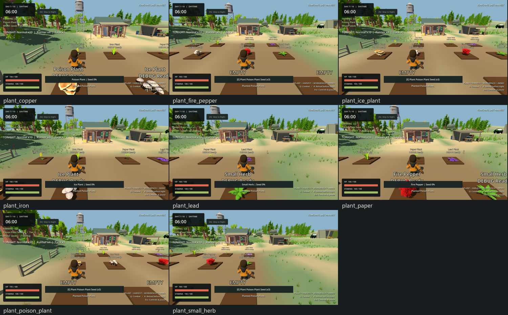
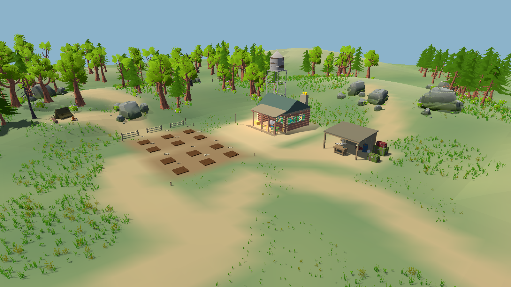
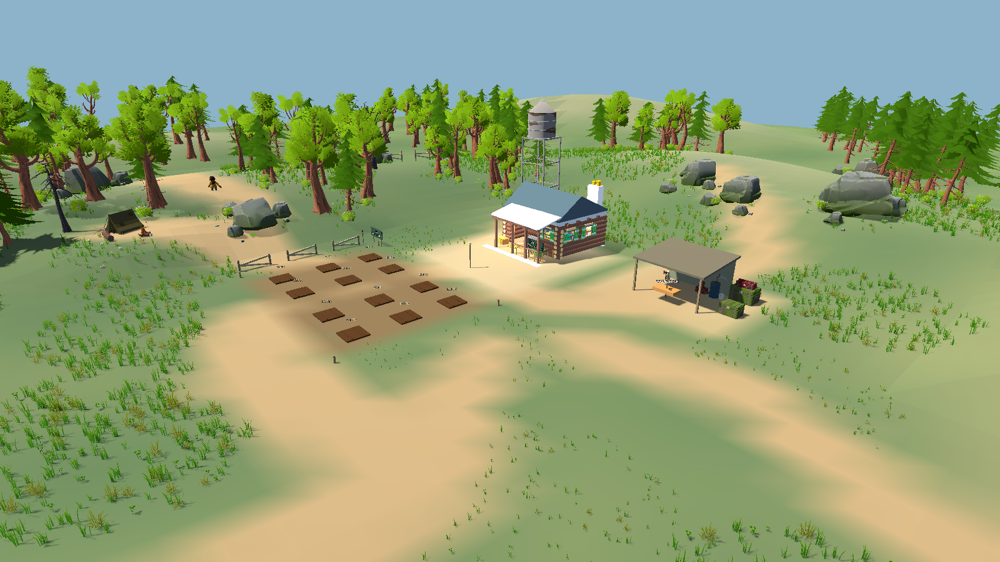

# Somchai's Last Harvest

## Play in your browser (latest build)

The latest game, including the UI polish pass, is exported to `docs/index.html`.
After pushing the files, enable GitHub Pages using **main /docs**.
Play URL after deployment: **https://siraanpimpa.github.io/project3d_2026/**.
[Publishing and rebuild instructions](docs/WEB_README.md).


## Current: Gameplay & Character Refinement

**Complete — STOP for user review.** Open current `project.godot` in Godot4.7 /Compatibility and press F5. Sprint lasts7.17s instead of4.57s; stamina starts recovering after0.67s. Existing Matt locomotion, low-ready rifle hold and vertical aim are refined. Day1 includes an ammo-free Wooden Bat: Q to Combat, wheel to bat, LMB to swing without RMB. Damage10, range1.6m, interval0.85s. Eight existing crops now use eight distinct native models and their existing growth stages.



[GAMEPLAY_REFINEMENT_REPORT.md](GAMEPLAY_REFINEMENT_REPORT.md) covers all15 requested topics, measured before/after results, animation asset status, bat balance, tests and remaining visual limits. [Plant mapping and all68 Nature sources](PLANT_VISUAL_ASSET_MAPPING.md), [evidence](docs/gameplay_refinement/README.md), [current test instructions](tests/README.md). Inventory/farming/crafting/AI/waves/clock/progression/map cores are preserved. The historical EXE/PCK is older; it has not been regenerated.

## Historical: Final environment cleanup

**Complete — STOP for map review.** Open this source project in Godot 4.7 /Compatibility and press F5. The 112×112 m playable rural world keeps its home/farm/workshop/forest/depot and separate southeast rescue clearing. Finished roof/wall/support connections, muted Cabin exterior, grounded bench/tools/stock, curated props, no forced landing asphalt/gantry, blended earth edges. 56 decorative model sources /11,707 placements; gameplay and major layout preserved.



[MAP_FINAL_CLEANUP_REPORT.md](MAP_FINAL_CLEANUP_REPORT.md) covers all twelve requested topics, before/after views, interactions/routes/night/ending, performance variation and source preservation. [Asset usage](MAP_ASSET_USAGE.md), [evidence](docs/map_final_cleanup/README.md), [test instructions](tests/README.md). Historical exported EXE/PCK uses an older map.

## Earlier phase records

The following sections preserve earlier versions and their stated counts; current source/evidence is described above.

## Historical source: Map Beautification & Spatial Recomposition

112×112 m playable rural world /240×240 m visual scenery. Furnished Cabin home, spacious twelve-plot farm and independent workshop; dense varied forest/grass edges; curved road to a separate southeast evacuation clearing.70 model sources reused, including the supplied Cabin. Open current source in Godot4.7 /Compatibility and press F5.

Read [MAP_BEAUTIFICATION_REPORT.md](MAP_BEAUTIFICATION_REPORT.md) for before/after images, actual movement/farming/night/navigation/ending checks, scope verification and measured performance. [MAP_ASSET_USAGE.md](MAP_ASSET_USAGE.md) maps models to purpose and zone. **Complete — STOP for map review.** The historical exported EXE/PCK still contains an earlier world.



The preceding [Major Map Redesign](MAP_REDESIGN_REPORT.md) and [Refinement Pass1](POST_PRODUCTION_REFINEMENT_1.md) reports/evidence remain historical records.

## Refinement pass1 source update

Current source adds a more readable farm/base/approach map, improved rifle/character poses and **N: Skip to Night** with mandatory confirmation. Plants grow over the skipped time; HP, ammo and day are not rewarded. Read [POST_PRODUCTION_REFINEMENT_1.md](POST_PRODUCTION_REFINEMENT_1.md) for current tests and limits.

Run current source with Godot4.7/Compatibility (F5). The packaged v0.1.0-demo below is the historical Phase10 candidate and has not been regenerated by this source refinement pass. Current verification uses4.7.stable on RTX4060Laptop; do not attribute old release performance to the new source.

**v0.1.0-demo** - a third-person farming and survival shooter built with Godot4.7.2 / Compatibility.

Grow supplies during the day, craft ammunition, survive ten nights of zombies and reach the rescue helicopter on the morning of Day11.

## Run the Windows candidate

Open `release/SomchaisLastHarvest_v0.1.0_demo/SomchaisLastHarvest.exe`. Keep the `.pck` beside it. The release folder and ZIP are local build artifacts, excluded from Git. The source repository contains the export preset and reproducible QA tooling.

Main Menu offers Play, How To Play and Quit. Pause provides Resume, guide, Restart and Main Menu. There is no save: restarting or closing loses the current campaign.

## Play

1. Select Lead/Paper/Copper seeds with the mouse wheel and press E at empty plots.
2. Harvest ready crops, go to Workbench, then craft Basic Ammo.
3. Q switches to Combat. R reloads the rifle, hold RMB to aim and LMB to fire. Wheel to Wooden Bat and LMB to swing without ammo or RMB.
4. Prepare before18:00; move away from attackers while reloading. Clear the wave and use the shelter bed for full recovery, or survive to dawn without healing.
5. Survive Night10 to see rescue, then Play Again or return to Main Menu.

WASD moves, Shift sprints, Tab opens inventory, Esc closes the current panel/pauses, V changes shoulder. See [CONTROLS.md](CONTROLS.md).

Current source has Basic Rifle/Basic Ammo and the Wooden Bat fallback. Medicine and elemental ammo are craft-only. Crops/recipes unlock on Days3/5/7; daily basic seed supplies grow with the difficulty curve. See [FINAL_BALANCE.md](FINAL_BALANCE.md).

## Source and export

Import `project.godot` into Godot4.7.2, then F5. Install the matching Windows x86_64 export templates. Export the **Windows Desktop** release preset. Runtime needs no Godot editor installation. Tested on Windows with i5-9300H and RTX2060; minimum hardware and other operating systems are not certified.

```powershell
./tests/run_tests.ps1 -Godot 'PATH_TO_GODOT_CONSOLE.exe' -WithRendering
# Optional sustained campaign and profiling:
./tests/run_tests.ps1 -Godot 'PATH_TO_GODOT_CONSOLE.exe' -WithCampaign -WithProfiling
python tools/export_qa.py 'PATH_TO_GODOT_CONSOLE.exe' campaign
```

`export_qa.py` creates an isolated release-template QA entry scene and restores project settings in `finally`. Gameplay resources match the candidate; normal release excludes test scripts and uses Main Menu. QA variants are not the submission build. The release executable does not support the editor's `--script` switch.

## Delivery notes

[FINAL_QA_REPORT.md](FINAL_QA_REPORT.md) records results and test boundaries. [KNOWN_ISSUES.md](KNOWN_ISSUES.md) lists actual limitations. [ASSET_CREDITS.md](ASSET_CREDITS.md) records asset provenance and missing pack licenses. Godot engine license/notices are bundled. Confirm the original GLB pack distribution rights before publishing or submitting where those rights are required. Team member information was not supplied and is not invented.
